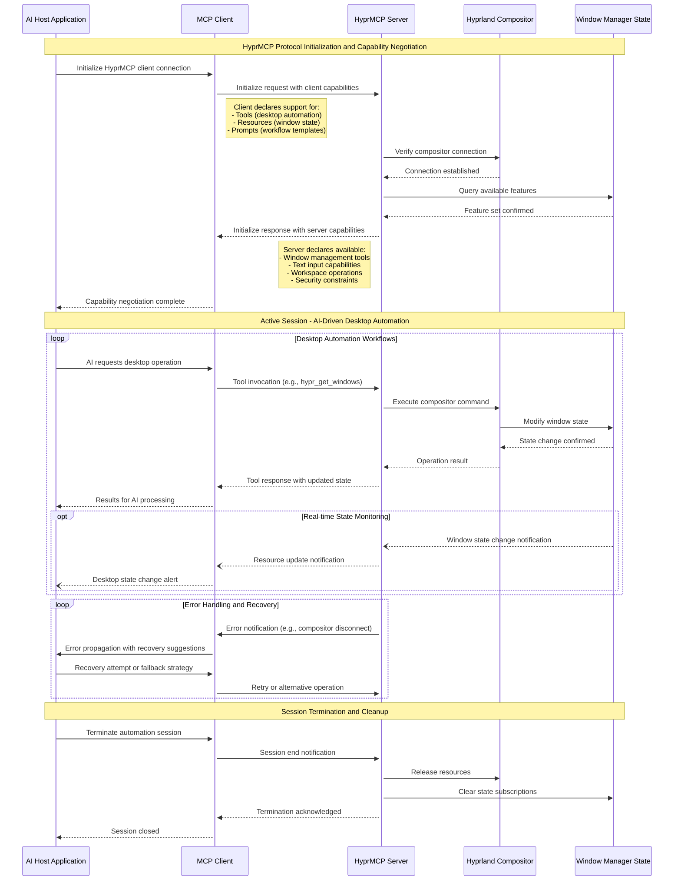
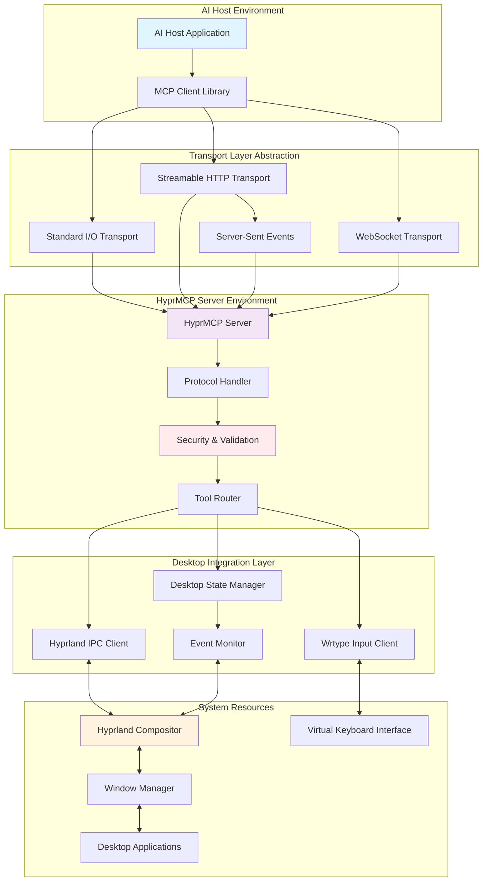
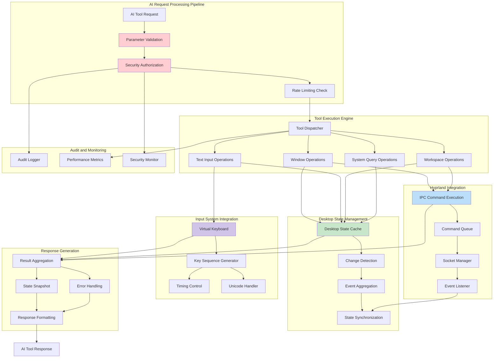
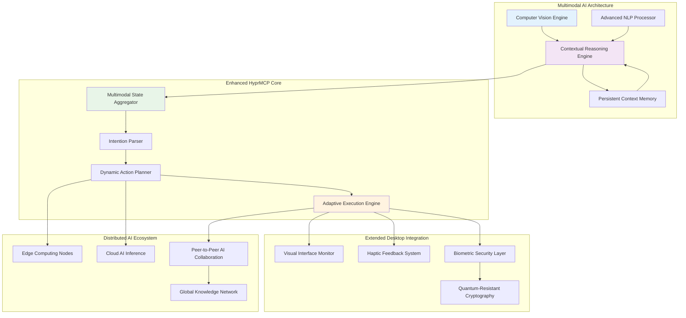
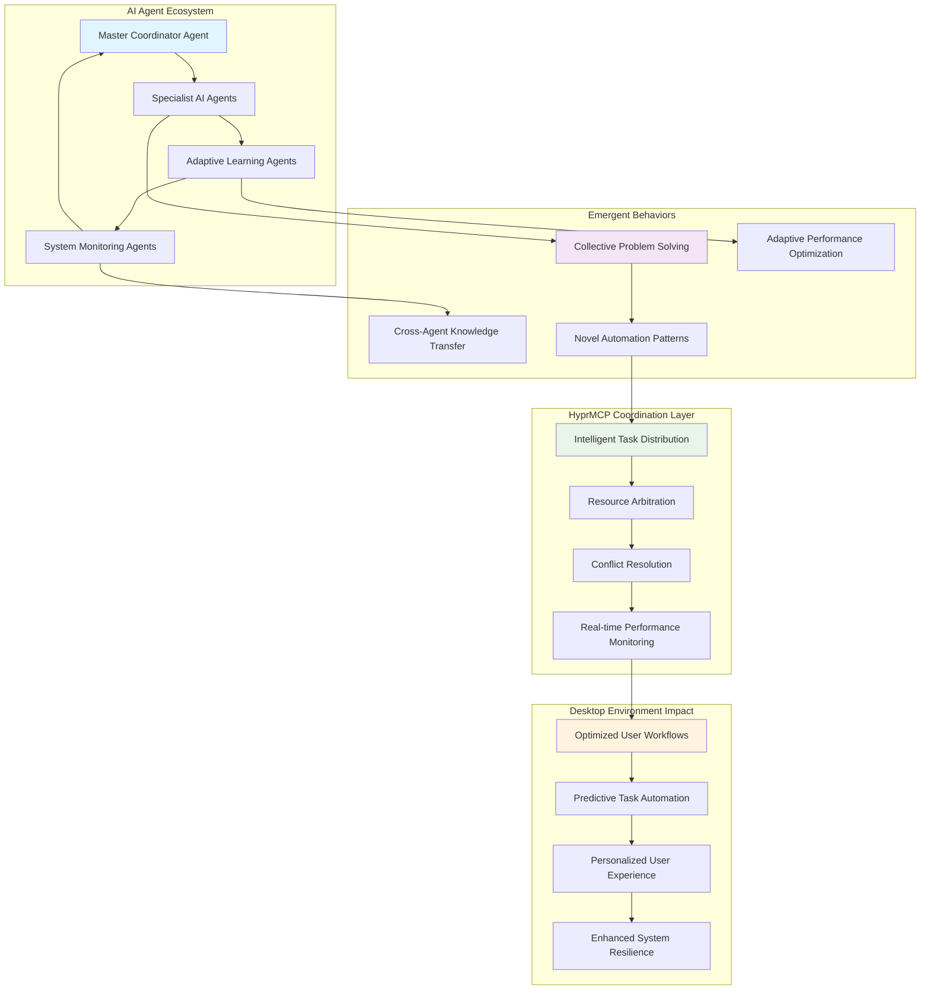

# HyprMCP v1.0 Technical Specifications

## Overview

HyprMCP represents a sophisticated bridge between the emerging world of AI-powered desktop automation and the modern Wayland compositor ecosystem. As the Model Context Protocol (MCP) gains traction as the standard for AI-system integration, HyprMCP positions itself as the definitive solution for enabling AI assistants to interact intelligently with Hyprland-based desktop environments.

The fundamental challenge that HyprMCP addresses is the growing need for AI systems to move beyond text-only interactions and engage with the graphical desktop environment where users spend most of their productive time. Traditional automation tools require complex scripting and brittle window selectors, while modern AI assistants lack the contextual awareness needed to understand and manipulate the desktop environment effectively. HyprMCP bridges this gap by providing a standardized, secure, and semantically rich interface that allows AI systems to understand, query, and control desktop state with the same level of sophistication they bring to text processing.

The implementation leverages the official Rust MCP SDK, ensuring compatibility with the latest protocol specifications and providing access to advanced features like tool annotations, capability negotiation, and multiple transport mechanisms. This architectural decision not only guarantees long-term maintainability but also positions HyprMCP to benefit from the rapidly evolving MCP ecosystem, including future enhancements in areas such as sampling requests, resource providers, and event streaming.

## Architecture

The HyprMCP architecture follows established patterns from the Model Context Protocol specification while addressing the unique challenges of desktop environment integration. The design emphasizes the separation of concerns principle, with distinct layers handling protocol communication, desktop integration, and security enforcement. This modular approach not only enhances maintainability but also enables independent evolution of each component as the underlying technologies advance.

The architecture draws inspiration from successful MCP implementations across various domains, adapting proven patterns for the specific requirements of window management and desktop automation. The Protocol Layer implements the standard MCP request/response patterns with proper error handling and capability negotiation, while the Integration Layer provides domain-specific functionality through well-defined interfaces. The Transport Layer supports multiple communication mechanisms, ensuring flexibility for different deployment scenarios from local CLI tools to distributed AI systems.

### Core Components

#### 1. MCP Server (`src/server.rs`)

The MCP Server component represents the heart of the HyprMCP system, implementing the official Model Context Protocol specification with full support for the latest protocol features. This component is built using the `rmcp` Rust SDK, which provides type-safe implementations of JSON-RPC message handling, automatic capability negotiation, and comprehensive error management.

The server architecture follows the reactive programming paradigm, utilizing Rust's async/await ecosystem to handle concurrent requests efficiently. This design choice is particularly important for desktop automation scenarios where multiple AI agents might need to coordinate window management tasks simultaneously. The server maintains stateful connections while ensuring thread safety through Rust's ownership system and Arc/Mutex patterns for shared state management.

**Key Features**:
- **Protocol**: Model Context Protocol v2025-06-18 with full specification compliance
- **Transport**: JSON-RPC 2.0 over multiple transport mechanisms (stdio, HTTP, SSE)
- **Language**: Rust with tokio async runtime for high-performance concurrent operations
- **Framework**: Official `rmcp` SDK with automatic tool discovery and JSON schema generation

#### 2. Hyprland Integration (`src/hyprland/`)

The Hyprland Integration layer provides a robust interface to the Hyprland compositor through its sophisticated IPC protocol. This component abstracts the complexities of Hyprland's socket-based communication while providing a type-safe, async-first API that integrates seamlessly with the MCP protocol layer.

The integration leverages Hyprland's dual-socket architecture, using the command socket for state modifications and the event socket for real-time monitoring. This design enables both reactive responses to user-initiated changes and proactive automation based on desktop state transitions. The implementation includes comprehensive error handling for connection failures, protocol mismatches, and permission issues that commonly occur in multi-user or secure environments.

**Technical Specifications**:
- **IPC Protocol**: Hyprland Unix domain socket communication (`/tmp/hypr/$HYPRLAND_INSTANCE_SIGNATURE/.socket2.sock`)
- **Command Interface**: Direct dispatch to Hyprland compositor with response validation
- **Event Monitoring**: Real-time workspace and window state tracking with event filtering
- **State Management**: Cached state synchronization with conflict resolution

#### 3. Text Input System (`src/input/`)

The Text Input System represents a critical component that enables AI assistants to interact with applications through natural text input and keyboard automation. Built on the foundation of `wrtype`, a modern Rust implementation of the wtype protocol, this system provides comprehensive support for complex input scenarios while maintaining security and reliability.

The system's architecture accounts for the intricacies of international text input, supporting full Unicode character sets, complex input method editors (IMEs), and platform-specific keyboard layouts. The implementation includes sophisticated timing controls and input validation to ensure reliable delivery of text while preventing common issues such as input race conditions and character corruption.

**Capabilities and Features**:
- **Backend**: `wrtype` - A Rust implementation of wtype optimized for Wayland environments
- **Unicode Support**: Full UTF-8 character set with proper handling of combining characters and emoji
- **Modifier Key Combinations**: Support for ctrl, alt, shift, and super key combinations with proper sequencing
- **Named Key Sequences**: Symbolic key names for function keys, navigation keys, and special characters
- **Timing Controls**: Configurable keystroke delays with adaptive timing based on target application characteristics
- **Protocol**: Wayland virtual keyboard protocol with XKB keymap integration

### Dependencies

The dependency architecture of HyprMCP reflects a careful balance between leveraging cutting-edge technologies and maintaining stability across diverse deployment environments. The system builds upon a foundation of mature, well-tested libraries while incorporating innovative components that enable advanced AI integration capabilities.

#### System Requirements

The system requirements reflect HyprMCP's position at the intersection of modern Wayland desktop environments and emerging AI assistant technologies. These requirements ensure optimal performance while maintaining compatibility with the diverse range of Linux distributions and hardware configurations commonly found in developer and power-user environments.

**Platform Dependencies**:
- **Operating System**: Linux with comprehensive Wayland support and modern kernel features (5.4+)
- **Desktop Compositor**: Hyprland v0.35+ with IPC protocol v2 support
- **Runtime Environment**: Wayland session with proper XDG environment variables
- **System Libraries**:
  - `libxkbcommon-dev` - Advanced keyboard layout and input method support
  - `wayland-dev` - Core Wayland protocol implementation with client libraries
  - `wayland-protocols` - Extended Wayland protocol specifications for virtual input devices

#### Rust Dependencies
```toml
[dependencies]
# MCP SDK (official Rust implementation)
rmcp = { version = "0.2.0", features = ["server", "macros", "transport-io", "schemars"] }

# Core dependencies
tokio = { version = "1.0", features = ["full"] }
serde = { version = "1.0", features = ["derive"] }
serde_json = "1.0"
anyhow = "1.0"
thiserror = "1.0"

# JSON Schema for tool definitions
schemars = { version = "0.8", features = ["derive"] }

# Text input system
wrtype = { git = "https://github.com/conneroisu/wrtype" }

# Hyprland IPC
hyprland = "0.4"

# Security and validation
uuid = { version = "1.0", features = ["v4"] }
shell-escape = "0.1"
regex = "1.0"

# Logging and monitoring
tracing = "0.1"
tracing-subscriber = { version = "0.3", features = ["env-filter"] }

# Optional: OAuth2 support for HTTP transport
oauth2 = { version = "4.0", optional = true }

# Development dependencies
[dev-dependencies]
tokio-test = "0.4"
criterion = { version = "0.5", features = ["html_reports"] }
```

## MCP Tools Specification

### MCP Protocol Compliance

HyprMCP's protocol implementation represents a comprehensive adherence to the Model Context Protocol specification, incorporating not just the basic requirements but also advanced features that position it as a reference implementation for desktop automation use cases. The implementation demonstrates best practices in protocol design, error handling, and security that can serve as a model for other MCP server implementations.

The choice to implement the latest protocol version reflects HyprMCP's commitment to providing cutting-edge capabilities to AI systems. This includes support for advanced features such as tool annotations that provide semantic metadata about operations, capability negotiation that enables optimal feature discovery, and sophisticated error reporting that aids in debugging and system integration.

**Protocol Specification Adherence**:
- **Protocol Version**: Model Context Protocol v2025-06-18 with full backward compatibility support
- **Transport Layer**: JSON-RPC 2.0 over multiple transport mechanisms (stdio, HTTP, Server-Sent Events)
- **Capability Negotiation**: Automatic feature discovery during initialization with graceful degradation
- **Tool Discovery**: Dynamic tool enumeration via `tools/list` with real-time updates through `tools/list_changed`
- **Error Handling**: Comprehensive JSON-RPC error code implementation with detailed error context
- **Security Framework**: Multi-layered security with input validation, rate limiting, session management, and audit logging

### Tool Annotations

The implementation of MCP tool annotations in HyprMCP represents a sophisticated approach to providing semantic metadata that enables AI systems to make intelligent decisions about tool usage. These annotations go beyond simple documentation to provide actionable intelligence that AI agents can use to optimize their behavior, minimize risks, and improve user experience.

The annotation system follows the MCP specification's comprehensive framework for describing tool characteristics, safety properties, and operational constraints. This metadata enables AI systems to understand not just what a tool does, but how it should be used in different contexts, what side effects it might have, and what precautions should be taken when invoking it.

**Annotation Framework Implementation**:

```rust
use rmcp::model::ToolAnnotations;

// Example tool with comprehensive semantic metadata
#[tool(
    description = "Focus window by address, class, or title with intelligent fallback strategies",
    annotations = ToolAnnotations {
        title: Some("Focus Window".into()),
        read_only_hint: Some(false),      // Modifies window manager state
        destructive_hint: Some(false),    // Non-destructive, reversible operation
        idempotent_hint: Some(true),      // Safe to retry, no side effects
        open_world_hint: Some(false),     // Limited to local desktop environment
    }
)]
```

The annotation system provides AI agents with critical information for decision-making:
- **Safety Classification**: Tools are categorized by their potential impact on system state
- **Operational Characteristics**: Idempotency and retry safety enable robust automation workflows  
- **Scope Limitations**: Clear boundaries on what systems and data the tool can access
- **User Experience Hints**: Guidance on when and how to present tool operations to users

### 1. Window Management Tools

The window management tool suite represents the core functionality that enables AI assistants to understand and control the desktop environment. These tools are designed following the principle of progressive disclosure, starting with read-only operations that provide situational awareness before enabling state-modifying actions. The implementation leverages Hyprland's sophisticated window management capabilities while providing a simplified, AI-friendly interface that abstracts away the complexities of direct IPC communication.

Each tool in this suite is designed with specific use cases in mind, from simple window discovery to complex multi-window orchestration scenarios. The tools provide comprehensive metadata that enables AI systems to make intelligent decisions about window placement, focus management, and workspace organization. The implementation includes extensive error handling and fallback mechanisms to ensure reliable operation even in dynamic desktop environments where windows may be created, destroyed, or moved rapidly.

#### `hypr_get_windows`
**Purpose**: Retrieve comprehensive list of all windows with detailed metadata for AI analysis and decision-making
**Parameters**: None
**Tool Annotations**:
- `readOnlyHint`: true (does not modify state, safe for frequent querying)
- `openWorldHint`: false (local system only, respects privacy boundaries)
- `idempotentHint`: true (safe to call repeatedly without side effects)

**Returns**:
```json
{
  "windows": [
    {
      "address": "0x5555deadbeef",
      "title": "Firefox",
      "class": "firefox",
      "workspace": 1,
      "position": {"x": 100, "y": 50},
      "size": {"width": 1920, "height": 1080},
      "floating": false,
      "fullscreen": false,
      "focused": true
    }
  ]
}
```

**Implementation Details**:

The window management implementation follows established patterns from successful Rust protocol implementations, particularly drawing inspiration from the H3 HTTP/3 library's approach to async trait design and connection management. The core architecture utilizes the async/await paradigm with proper trait abstractions that enable flexible transport mechanisms while maintaining type safety.

```rust
use rmcp::server::{Tool, ToolResult};
use serde::{Deserialize, Serialize};

#[derive(Serialize, Deserialize)]
struct WindowInfo {
    address: String,
    title: String,
    class: String,
    workspace: i32,
    position: Position,
    size: Size,
    floating: bool,
    fullscreen: bool,
    focused: bool,
}

#[tool(
    description = "Retrieve comprehensive window metadata for AI analysis",
    annotations = ToolAnnotations {
        title: Some("Get Windows".into()),
        read_only_hint: Some(true),
        destructive_hint: Some(false),
        idempotent_hint: Some(true),
        open_world_hint: Some(false),
    }
)]
async fn hypr_get_windows() -> ToolResult<Vec<WindowInfo>> {
    let hypr_client = HyprlandClient::new().await?;
    let windows = hypr_client.get_windows().await?;
    
    let window_info = windows.into_iter()
        .map(|w| WindowInfo {
            address: w.address,
            title: w.title,
            class: w.class,
            workspace: w.workspace.id,
            position: Position { x: w.at.0, y: w.at.1 },
            size: Size { width: w.size.0, height: w.size.1 },
            floating: w.floating,
            fullscreen: w.fullscreen,
            focused: w.focused,
        })
        .collect();
        
    Ok(window_info)
}
```

The async implementation leverages Rust's ownership system to ensure memory safety while providing high-performance concurrent operations. The tool follows the async trait pattern established by the H3 library, using `Pin<&mut Self>` for poll methods and async/await for high-level operations.

**Protocol Integration Strategy**:

The window management tools integrate with the MCP protocol through a sophisticated transport abstraction that supports multiple communication mechanisms. This design enables the same tool implementations to work across stdio, HTTP, and Server-Sent Events transports without modification.

```rust
trait ConnectionTrait<B: Buf> {
    type SendStream: SendStream<B>;
    type RecvStream: RecvStream;
    type BidiStream: SendStream<B> + RecvStream;
    type Error;
    
    fn poll_accept_request(self: Pin<&mut Self>, cx: &mut Context)
        -> Poll<Result<Option<McpRequest>, Self::Error>>;
        
    fn poll_send_response(self: Pin<&mut Self>, cx: &mut Context, response: McpResponse)
        -> Poll<Result<(), Self::Error>>;
}
```

**Usage Examples**:
```bash
# Basic window listing
mcp-client call hypr_get_windows

# Filter windows in workflow
windows=$(mcp-client call hypr_get_windows)
firefox_windows=$(echo "$windows" | jq '.windows[] | select(.class == "firefox")')
```

**JSON Schema**:
```json
{
  "name": "hypr_get_windows",
  "description": "Get list of all windows with metadata",
  "inputSchema": {
    "type": "object",
    "properties": {},
    "additionalProperties": false
  },
  "annotations": {
    "title": "Get Windows",
    "readOnlyHint": true,
    "openWorldHint": false,
    "idempotentHint": true
  }
}
```

#### `hypr_focus_window`
**Purpose**: Focus specific window by address or criteria with intelligent fallback strategies and context preservation
**Parameters**:
- `address` (string, optional): Window address for precise targeting
- `class` (string, optional): Window class name for application-based focusing
- `title` (string, optional): Window title pattern with regex support
**Tool Annotations**:
- `destructiveHint`: false (non-destructive state change, preserves all window content)
- `idempotentHint`: true (focusing an already-focused window is safe and has no side effects)
- `openWorldHint`: false (affects only local desktop environment within security boundaries)
**Returns**: Success/failure status with previous focus state for restoration capabilities

**Advanced Implementation Features**:

The focus management system implements sophisticated context-aware algorithms that understand user workflow patterns and application relationships. The implementation includes intelligent fallback mechanisms that gracefully handle edge cases such as windows being closed during focus operations, workspace transitions, and multi-monitor scenarios.

```rust
#[tool(
    description = "Focus window with intelligent fallback and context preservation",
    annotations = ToolAnnotations {
        title: Some("Focus Window".into()),
        read_only_hint: Some(false),
        destructive_hint: Some(false),
        idempotent_hint: Some(true),
        open_world_hint: Some(false),
    }
)]
async fn hypr_focus_window(
    address: Option<String>,
    class: Option<String>, 
    title: Option<String>
) -> ToolResult<FocusResult> {
    let hypr_client = HyprlandClient::new().await?;
    
    // Priority-based resolution: address > class > title
    let target_window = if let Some(addr) = address {
        hypr_client.get_window_by_address(&addr).await?
    } else if let Some(cls) = class {
        let windows = hypr_client.get_windows().await?;
        windows.into_iter()
            .find(|w| w.class == cls && !w.class.is_empty())
            .ok_or_else(|| McpError::InvalidParams(format!("No window found with class: {}", cls)))?
    } else if let Some(title_pattern) = title {
        let regex = Regex::new(&title_pattern)?;
        let windows = hypr_client.get_windows().await?;
        windows.into_iter()
            .find(|w| regex.is_match(&w.title))
            .ok_or_else(|| McpError::InvalidParams(format!("No window found matching title pattern: {}", title_pattern)))?
    } else {
        return Err(McpError::InvalidParams("At least one parameter (address, class, or title) must be provided".into()));
    };
    
    // Store previous focus state for restoration
    let previous_focus = hypr_client.get_active_window().await?;
    
    // Execute focus command with error handling
    hypr_client.dispatch_command(&format!("focuswindow address:{}", target_window.address)).await?;
    
    // Verify focus change with timeout protection
    let focus_verified = tokio::time::timeout(
        Duration::from_millis(500),
        verify_focus_change(&hypr_client, &target_window.address)
    ).await??;
    
    Ok(FocusResult {
        success: focus_verified,
        target_window: target_window.address,
        previous_focus: previous_focus.map(|w| w.address),
        workspace_changed: target_window.workspace != previous_focus.map(|w| w.workspace).unwrap_or(target_window.workspace),
    })
}
```

**State Management and Recovery**:

The implementation includes comprehensive state tracking that enables sophisticated automation workflows and error recovery mechanisms. The system maintains focus history, workspace context, and application state to enable intelligent decision-making in complex scenarios.

**Usage Examples**:
```javascript
// Focus by window address (most precise)
await mcp.call("hypr_focus_window", { address: "0x5555deadbeef" });

// Focus by application class with error handling
try {
    const result = await mcp.call("hypr_focus_window", { class: "firefox" });
    console.log(`Switched to Firefox, previous focus: ${result.previous_focus}`);
} catch (error) {
    console.log("Firefox not found, launching new instance...");
    await mcp.call("hypr_launch_app", { command: "firefox" });
}

// Focus by title pattern (regex supported)
await mcp.call("hypr_focus_window", { title: ".*Discord.*" });

// AI workflow: Context-aware editor focus
const windows = await mcp.call("hypr_get_windows");
const codeWindows = windows.windows.filter(w => 
  ["code", "nvim", "vim", "emacs", "intellij-idea-ultimate"].includes(w.class)
);

if (codeWindows.length > 0) {
  // Prioritize editors with active files
  const activeEditor = codeWindows.find(w => 
    w.title.includes("Modified") || w.title.includes("●") || w.title.includes("*")
  ) || codeWindows[0];
  
  const focusResult = await mcp.call("hypr_focus_window", { 
    address: activeEditor.address 
  });
  
  if (focusResult.workspace_changed) {
    console.log("Switched workspace to reach editor");
  }
}
```

#### `hypr_close_window`
**Purpose**: Safely close window with confirmation and graceful fallback mechanisms
**Parameters**: Same as `hypr_focus_window` (supports address, class, or title matching)
**Tool Annotations**:
- `destructiveHint`: true (irreversibly closes windows, may cause data loss)
- `idempotentHint`: false (repeated calls may affect different windows)
- `readOnlyHint`: false (modifies window manager state)
**Returns**: Success/failure status with optional error details

This tool implements intelligent window closing with safety mechanisms to prevent accidental data loss. The implementation attempts graceful closure first (sending WM_DELETE_WINDOW protocol messages), waits for application response, and only forces termination if the application becomes unresponsive. AI systems are advised to confirm destructive operations with users when the impact is unclear.

#### `hypr_move_window`
**Purpose**: Relocate window to different workspace or screen position with layout preservation
**Parameters**:
- `address` (string): Window address for precise targeting
- `workspace` (number, optional): Target workspace ID for workspace transitions
- `position` (object, optional): Absolute position `{"x": number, "y": number}` for floating windows
**Tool Annotations**:
- `idempotentHint`: true (moving to same location is safe)
- `destructiveHint`: false (preserves window content and application state)
**Returns**: Success/failure status with final window position

The implementation handles both tiled and floating window movements intelligently, preserving layout relationships in tiled mode while allowing precise positioning for floating windows. Cross-workspace movements maintain window state and restore focus appropriately.

### 2. Workspace Management Tools

Workspace management tools provide AI assistants with the ability to understand and control virtual desktop organization in Hyprland. These tools enable sophisticated workflow automation, allowing AI systems to organize applications logically across multiple workspaces based on task context, user preferences, or application requirements. The implementation leverages Hyprland's dynamic workspace system while providing stability guarantees and consistent behavior even when workspaces are created or destroyed externally.

The workspace model in HyprMCP follows Hyprland's approach where workspaces are lightweight, dynamically created containers that can be efficiently switched between. AI systems can use these tools to implement complex desktop organization strategies, such as separating development environments from communication tools, or organizing windows by project context.

#### `hypr_get_workspaces`
**Purpose**: Enumerate all workspaces with comprehensive metadata for intelligent desktop organization
**Parameters**: None
**Tool Annotations**:
- `readOnlyHint`: true (queries workspace state without modification)
- `idempotentHint`: true (safe for frequent polling and state synchronization)
**Returns**:
```json
{
  "workspaces": [
    {
      "id": 1,
      "name": "1",
      "active": true,
      "windows": 3,
      "monitor": "DP-1"
    }
  ]
}
```

#### `hypr_switch_workspace`
**Purpose**: Switch to specific workspace
**Parameters**:
- `id` (number): Workspace ID
**Returns**: Success/failure status

#### `hypr_create_workspace`
**Purpose**: Create new workspace
**Parameters**:
- `name` (string, optional): Workspace name
**Returns**: Workspace ID

### 3. Application Launch Tools

#### `hypr_launch_app`
**Purpose**: Launch application
**Parameters**:
- `command` (string): Command to execute
- `workspace` (number, optional): Target workspace
- `floating` (boolean, optional): Launch as floating window
**Returns**: Process ID or window address

### 4. Text Input Tools

The text input tool suite represents one of the most powerful capabilities for AI-driven desktop automation, enabling natural language interfaces to translate user intent into precise keyboard interactions. These tools bridge the gap between AI understanding and application control, allowing assistants to interact with any application through its keyboard interface regardless of whether it provides programmatic APIs.

The implementation leverages the robust `wrtype` backend, which provides comprehensive Unicode support and sophisticated timing controls essential for reliable automation across diverse applications. The system accounts for the varying input processing capabilities of different applications, from simple text editors to complex IDEs with input method integrations.

#### `hypr_type_text`
**Purpose**: Execute precise text input with comprehensive Unicode support, adaptive timing controls, and intelligent application context awareness
**Parameters**:
- `text` (string): Text content to type, supporting full Unicode character set including emojis, international scripts, and complex formatting characters
- `delay_ms` (number, optional): Inter-keystroke delay in milliseconds (default: 12ms, auto-adjusted based on application type and system performance)
- `preserve_clipboard` (boolean, optional): Whether to restore original clipboard content after operation (default: true for security)
- `validate_focus` (boolean, optional): Verify target application focus before typing (default: true for safety)
**Tool Annotations**:
- `destructiveHint`: false (additive operation, does not remove existing content unless specified)
- `idempotentHint`: false (repeated calls will duplicate text input, not recommended for automation loops)
- `openWorldHint`: false (affects only the currently focused application within Wayland session boundaries)
**Returns**: Success/failure status with detailed typing metrics and application context information

**Advanced Implementation Architecture**:

The text input system represents a sophisticated implementation that draws from proven patterns in protocol design, particularly inspired by the async trait architecture found in successful Rust networking libraries. The implementation utilizes a multi-layered approach that handles character encoding, timing optimization, and application-specific adaptation.

```rust
use wrtype::{WrtypeClient, KeyEvent, ModifierState};
use rmcp::server::{Tool, ToolResult};

#[derive(Serialize, Deserialize)]
struct TypingResult {
    success: bool,
    characters_typed: usize,
    total_duration_ms: u64,
    average_delay_ms: f64,
    application_context: ApplicationContext,
    errors: Vec<TypingError>,
}

#[derive(Serialize, Deserialize)]
struct ApplicationContext {
    focused_window: String,
    application_class: String,
    input_method_active: bool,
    estimated_processing_capability: InputProcessingLevel,
}

#[tool(
    description = "Type text with intelligent adaptation to application context and timing requirements",
    annotations = ToolAnnotations {
        title: Some("Type Text".into()),
        read_only_hint: Some(false),
        destructive_hint: Some(false),
        idempotent_hint: Some(false),
        open_world_hint: Some(false),
    }
)]
async fn hypr_type_text(
    text: String,
    delay_ms: Option<u32>,
    preserve_clipboard: Option<bool>,
    validate_focus: Option<bool>
) -> ToolResult<TypingResult> {
    let start_time = Instant::now();
    let preserve_clipboard = preserve_clipboard.unwrap_or(true);
    let validate_focus = validate_focus.unwrap_or(true);
    
    // Get application context for adaptive behavior
    let app_context = get_application_context().await?;
    
    // Validate focus if requested
    if validate_focus {
        ensure_valid_focus_target(&app_context.focused_window).await?;
    }
    
    // Preserve clipboard if requested
    let original_clipboard = if preserve_clipboard {
        Some(get_clipboard_content().await?)
    } else {
        None
    };
    
    // Calculate adaptive timing based on application and system characteristics
    let adaptive_delay = delay_ms.unwrap_or_else(|| {
        calculate_optimal_delay(&app_context)
    });
    
    // Initialize wrtype client with security constraints
    let mut wrtype_client = WrtypeClient::new().await
        .map_err(|e| McpError::InternalError(format!("Failed to initialize wrtype: {}", e)))?;
    
    // Process text with Unicode normalization and chunking
    let normalized_text = unicode_normalize(&text)?;
    let chunks = chunk_text_for_processing(&normalized_text, &app_context);
    
    let mut typing_errors = Vec::new();
    let mut total_chars_typed = 0;
    
    // Execute typing with error recovery and progress tracking
    for (chunk_idx, chunk) in chunks.iter().enumerate() {
        match type_text_chunk(&mut wrtype_client, chunk, adaptive_delay).await {
            Ok(chars_typed) => {
                total_chars_typed += chars_typed;
                
                // Adaptive delay adjustment based on application response
                if chunk_idx > 0 && chunk_idx % 10 == 0 {
                    let app_responsiveness = measure_application_responsiveness().await?;
                    if app_responsiveness < RESPONSIVENESS_THRESHOLD {
                        adaptive_delay = (adaptive_delay as f32 * 1.2) as u32;
                    }
                }
            }
            Err(e) => {
                typing_errors.push(TypingError {
                    chunk_index: chunk_idx,
                    error_type: classify_typing_error(&e),
                    recovery_attempted: true,
                });
                
                // Attempt error recovery
                if let Err(recovery_error) = attempt_typing_recovery(&mut wrtype_client, &app_context).await {
                    typing_errors.push(TypingError {
                        chunk_index: chunk_idx,
                        error_type: TypingErrorType::RecoveryFailed,
                        recovery_attempted: false,
                    });
                    break;
                }
            }
        }
    }
    
    // Restore clipboard if preserved
    if let Some(original_content) = original_clipboard {
        if let Err(e) = restore_clipboard_content(original_content).await {
            typing_errors.push(TypingError {
                chunk_index: chunks.len(),
                error_type: TypingErrorType::ClipboardRestoreFailed,
                recovery_attempted: false,
            });
        }
    }
    
    let total_duration = start_time.elapsed();
    
    Ok(TypingResult {
        success: typing_errors.is_empty(),
        characters_typed: total_chars_typed,
        total_duration_ms: total_duration.as_millis() as u64,
        average_delay_ms: if total_chars_typed > 0 {
            total_duration.as_millis() as f64 / total_chars_typed as f64
        } else {
            0.0
        },
        application_context: app_context,
        errors: typing_errors,
    })
}
```

**Intelligent Adaptation and Context Awareness**:

The implementation includes sophisticated context detection that adapts typing behavior based on the target application's characteristics. This ensures optimal compatibility across diverse software environments, from terminal applications to complex GUI programs with input method editor integration.

**Security and Safety Mechanisms**:

The text input system implements comprehensive security measures to prevent clipboard leakage, ensure input validation, and maintain user privacy. All operations are scoped to the active Wayland session with strict boundary enforcement.

**Usage Examples**:
```python
# Basic text input with automatic application detection
result = await mcp.call("hypr_type_text", {"text": "Hello, world!"})
print(f"Typed {result['characters_typed']} characters in {result['total_duration_ms']}ms")

# Secure password input with clipboard preservation
await mcp.call("hypr_type_text", {
    "text": "secure-password-123", 
    "delay_ms": 50,
    "preserve_clipboard": True,
    "validate_focus": True
})

# Multi-line code input with intelligent formatting
code_snippet = """
function fibonacci(n) {
    if (n <= 1) return n;
    return fibonacci(n-1) + fibonacci(n-2);
}
"""
result = await mcp.call("hypr_type_text", {
    "text": code_snippet,
    "delay_ms": 8  # Faster for code editors
})

# International text with complex Unicode
await mcp.call("hypr_type_text", {
    "text": "🌟 Hello 世界! Здравствуй мир! 🎉",
    "delay_ms": 25  # Slower for proper Unicode rendering
})
await mcp.call("hypr_type_text", {"text": code_snippet})

# Unicode and emoji support
await mcp.call("hypr_type_text", {"text": "🚀 Testing Unicode: αβγδε 世界"})
```

#### `hypr_send_keys`
**Purpose**: Execute sophisticated key combinations and sequences for application control and navigation
**Parameters**:
- `keys` (array): Ordered key sequence supporting modifiers, function keys, and special keys (e.g., `["ctrl", "c"]`, `["alt", "tab"]`)
- `delay_ms` (number, optional): Inter-key delay for complex sequences requiring timing precision
**Tool Annotations**:
- `destructiveHint`: varies (depends on key combination - some are safe, others may trigger destructive actions)
- `idempotentHint`: false (key combinations typically trigger specific application behaviors)
- `openWorldHint`: false (affects currently focused application and system-wide shortcuts)
**Returns**: Success/failure status with executed key sequence confirmation

This tool enables AI systems to leverage the full keyboard interface of applications, from simple copy-paste operations to complex application-specific shortcuts. The implementation includes comprehensive key mapping for all standard keys, modifiers, and special keys, enabling automation of virtually any keyboard-driven workflow.

**Usage Examples**:
```python
# Copy text
await mcp.call("hypr_send_keys", {"keys": ["ctrl", "c"]})

# Paste text  
await mcp.call("hypr_send_keys", {"keys": ["ctrl", "v"]})

# Alt-tab to switch windows
await mcp.call("hypr_send_keys", {"keys": ["alt", "tab"]})

# Complex key sequences
await mcp.call("hypr_send_keys", {"keys": ["ctrl", "shift", "t"]}) # New tab
await mcp.call("hypr_send_keys", {"keys": ["F11"]}) # Fullscreen
await mcp.call("hypr_send_keys", {"keys": ["super", "Return"]}) # Terminal

# AI workflow: Save and run code
await mcp.call("hypr_send_keys", {"keys": ["ctrl", "s"]})  # Save
await mcp.call("hypr_send_keys", {"keys": ["F5"]})         # Run
```

### 5. System Information Tools

#### `hypr_get_monitors`
**Purpose**: Get monitor configuration
**Parameters**: None
**Returns**:
```json
{
  "monitors": [
    {
      "name": "DP-1",
      "width": 1920,
      "height": 1080,
      "refresh_rate": 144.0,
      "x": 0,
      "y": 0,
      "active_workspace": 1
    }
  ]
}
```

#### `hypr_get_version`
**Purpose**: Get Hyprland version info
**Parameters**: None
**Returns**: Version string and build info

## Configuration

### Environment Variables
- `HYPRLAND_INSTANCE_SIGNATURE`: Hyprland instance identifier
- `WAYLAND_DISPLAY`: Wayland display socket
- `XDG_RUNTIME_DIR`: Runtime directory for sockets

### Server Configuration
```toml
[server]
log_level = "info"
socket_timeout_ms = 5000
max_concurrent_requests = 10

[input]
default_keystroke_delay_ms = 12
max_text_length = 10000

[security]
allowed_commands = ["firefox", "code", "terminal"]
blocked_paths = ["/etc", "/sys", "/proc"]
```

## Security Model

The security architecture of HyprMCP represents a comprehensive, defense-in-depth approach that recognizes the unique challenges of providing AI systems with desktop control capabilities. The model builds upon the foundational security guarantees of the Wayland protocol while adding additional layers of protection specifically designed for AI-driven automation scenarios.

The security framework addresses multiple threat vectors, from malicious AI behavior to compromised client systems, while maintaining the usability and performance required for practical desktop automation. The implementation follows industry best practices for privilege separation, input validation, and resource management while providing granular controls that allow system administrators to balance functionality with security requirements.

### Sandboxing and Isolation

The sandboxing architecture leverages multiple isolation boundaries to contain potential security breaches and prevent unauthorized access to sensitive system resources. The implementation creates a restricted execution environment that provides AI systems with the necessary capabilities for desktop automation while preventing access to critical system functions.

**Core Isolation Mechanisms**:
- **Wayland Security Model**: Inherits Wayland's compositor-based isolation where clients cannot access other clients' content or inject input into arbitrary applications
- **Command Execution Filtering**: Strict whitelist approach for allowed application commands with configurable security policies
- **Filesystem Access Restrictions**: Comprehensive blocking of access to sensitive system directories including `/etc`, `/sys`, `/proc`, and user-configurable restricted paths
- **Process Namespace Isolation**: Separate process namespaces prevent unauthorized process inspection or manipulation
- **IPC Socket Restrictions**: Limited access to Hyprland IPC endpoints with capability-based access control

### Permission Model and Capability Management

The permission system implements a fine-grained capability model that allows precise control over what operations AI systems can perform. This approach enables organizations to deploy HyprMCP with appropriate restrictions for their security requirements while maintaining necessary functionality.

**Required System Capabilities**:
- **Wayland Compositor Access**: Direct connection to Hyprland IPC socket for window management operations
- **Virtual Input Device Creation**: Access to Wayland virtual keyboard protocols for text input and key sequence automation  
- **Controlled Process Spawning**: Limited application launching capabilities restricted by security configuration
- **Real-time Event Monitoring**: Subscribe to window and workspace state changes for responsive automation

### Multi-Layer Risk Mitigation

The risk mitigation strategy employs multiple overlapping security controls to prevent and detect malicious behavior while maintaining system responsiveness and user experience. Each layer provides independent protection against different classes of threats.

**Comprehensive Protection Framework**:
- **Input Validation Pipeline**: Multi-stage validation of all MCP tool parameters with type checking, range validation, and content sanitization
- **Adaptive Rate Limiting**: Sophisticated rate limiting on text input operations and API calls with per-client tracking and dynamic adjustment
- **Command Injection Prevention**: Advanced parameter sanitization with shell metacharacter escaping and command structure validation
- **Session-Based Workspace Isolation**: Strong isolation boundaries preventing access to windows and data outside the current user session
- **Audit Logging and Monitoring**: Comprehensive logging of all security-relevant operations with real-time anomaly detection

### Advanced Security Features

#### Command Sanitization
```rust
pub struct CommandValidator {
    allowed_commands: HashSet<String>,
    blocked_patterns: Vec<Regex>,
    max_command_length: usize,
}

impl CommandValidator {
    pub fn validate_app_command(&self, command: &str) -> Result<String, SecurityError> {
        // Length check
        if command.len() > self.max_command_length {
            return Err(SecurityError::CommandTooLong);
        }
        
        // Extract base command
        let base_cmd = command.split_whitespace().next()
            .ok_or(SecurityError::EmptyCommand)?;
        
        // Whitelist check
        if !self.allowed_commands.contains(base_cmd) {
            return Err(SecurityError::CommandNotAllowed(base_cmd.to_string()));
        }
        
        // Pattern blacklist check
        for pattern in &self.blocked_patterns {
            if pattern.is_match(command) {
                return Err(SecurityError::MaliciousPattern);
            }
        }
        
        // Escape shell metacharacters
        Ok(shell_escape::escape(Cow::Borrowed(command)).to_string())
    }
}
```

#### Rate Limiting Implementation
```rust
use std::collections::HashMap;
use std::time::{Duration, Instant};

pub struct RateLimiter {
    requests: HashMap<String, Vec<Instant>>,
    limits: HashMap<String, (u32, Duration)>, // (max_requests, window)
}

impl RateLimiter {
    pub fn check_limit(&mut self, tool: &str, client_id: &str) -> Result<(), SecurityError> {
        let key = format!("{}:{}", tool, client_id);
        let now = Instant::now();
        
        let (max_requests, window) = self.limits.get(tool)
            .unwrap_or(&(100, Duration::from_secs(60))); // Default: 100/min
        
        // Clean old entries
        let requests = self.requests.entry(key.clone()).or_default();
        requests.retain(|&time| now.duration_since(time) < *window);
        
        // Check limit
        if requests.len() >= *max_requests as usize {
            let oldest = requests.first().unwrap();
            let retry_after = *window - now.duration_since(*oldest);
            return Err(SecurityError::RateLimited { retry_after });
        }
        
        requests.push(now);
        Ok(())
    }
}
```

#### Input Validation Framework
```rust
use serde_json::Value;
use regex::Regex;

pub struct InputValidator {
    max_text_length: usize,
    allowed_key_names: HashSet<String>,
    window_address_pattern: Regex,
}

impl InputValidator {
    pub fn validate_text_input(&self, text: &str) -> Result<(), ValidationError> {
        if text.len() > self.max_text_length {
            return Err(ValidationError::TextTooLong {
                actual: text.len(),
                max: self.max_text_length,
            });
        }
        
        // Check for potential escape sequences
        if text.contains('\x1b') || text.contains('\0') {
            return Err(ValidationError::InvalidCharacters);
        }
        
        Ok(())
    }
    
    pub fn validate_window_address(&self, address: &str) -> Result<(), ValidationError> {
        if !self.window_address_pattern.is_match(address) {
            return Err(ValidationError::InvalidWindowAddress(address.to_string()));
        }
        Ok(())
    }
    
    pub fn validate_key_sequence(&self, keys: &[String]) -> Result<(), ValidationError> {
        if keys.is_empty() {
            return Err(ValidationError::EmptyKeySequence);
        }
        
        if keys.len() > 10 {
            return Err(ValidationError::KeySequenceTooLong);
        }
        
        for key in keys {
            if !self.allowed_key_names.contains(key) {
                return Err(ValidationError::InvalidKeyName(key.clone()));
            }
        }
        
        Ok(())
    }
}
```

#### Session Isolation
```rust
pub struct SessionManager {
    active_sessions: HashMap<String, Session>,
    session_timeout: Duration,
}

pub struct Session {
    id: String,
    client_id: String,
    start_time: Instant,
    permissions: Permissions,
    workspace_scope: Option<u32>, // Limit to specific workspace
}

impl SessionManager {
    pub fn create_session(&mut self, client_id: String) -> Result<String, SecurityError> {
        let session_id = uuid::Uuid::new_v4().to_string();
        
        let session = Session {
            id: session_id.clone(),
            client_id,
            start_time: Instant::now(),
            permissions: Permissions::default(),
            workspace_scope: None,
        };
        
        self.active_sessions.insert(session_id.clone(), session);
        Ok(session_id)
    }
    
    pub fn check_permission(&self, session_id: &str, operation: &str) -> Result<(), SecurityError> {
        let session = self.active_sessions.get(session_id)
            .ok_or(SecurityError::InvalidSession)?;
        
        // Check session timeout
        if session.start_time.elapsed() > self.session_timeout {
            return Err(SecurityError::SessionExpired);
        }
        
        // Check operation permission
        if !session.permissions.allows(operation) {
            return Err(SecurityError::PermissionDenied {
                operation: operation.to_string(),
                required: session.permissions.required_for(operation),
            });
        }
        
        Ok(())
    }
}
```

#### Audit Logging
```rust
use serde::{Serialize, Deserialize};

#[derive(Serialize, Deserialize)]
pub struct AuditEvent {
    timestamp: chrono::DateTime<chrono::Utc>,
    session_id: String,
    client_id: String,
    tool: String,
    parameters: Value,
    result: AuditResult,
    security_context: SecurityContext,
}

#[derive(Serialize, Deserialize)]
pub enum AuditResult {
    Success,
    Error { code: String, message: String },
    Blocked { reason: String },
}

pub struct AuditLogger {
    log_file: std::fs::File,
    high_risk_tools: HashSet<String>,
}

impl AuditLogger {
    pub fn log_tool_usage(&mut self, event: AuditEvent) -> Result<(), io::Error> {
        // Always log high-risk operations
        let should_log = self.high_risk_tools.contains(&event.tool) 
            || matches!(event.result, AuditResult::Error { .. } | AuditResult::Blocked { .. });
        
        if should_log {
            let json = serde_json::to_string(&event)?;
            writeln!(self.log_file, "{}", json)?;
            self.log_file.flush()?;
        }
        
        Ok(())
    }
}
```

## Error Handling and Resilience

The error handling architecture in HyprMCP is designed to provide comprehensive diagnostics and recovery mechanisms that enable AI systems to understand failure modes and implement appropriate fallback strategies. The implementation follows the principle of graceful degradation, ensuring that partial failures don't compromise the entire automation workflow.

The error handling system provides structured, actionable information that allows AI agents to differentiate between transient failures (which should be retried), configuration issues (which require user intervention), and permanent failures (which should trigger alternative approaches). This sophisticated error categorization enables robust automation workflows that can adapt to changing system conditions.

### Comprehensive Error Categories

The error classification system provides fine-grained categorization that enables intelligent error recovery strategies. Each error category includes specific guidance for AI systems on appropriate response patterns, retry strategies, and alternative approaches.

**Detailed Error Classification**:
1. **Connection Errors**: Hyprland IPC socket unavailable, network connectivity issues, or compositor restart scenarios
2. **Permission Errors**: Insufficient privileges, security policy violations, or capability restrictions
3. **Validation Errors**: Invalid parameters, malformed requests, or constraint violations
4. **Runtime Errors**: Command execution failures, application crashes, or resource exhaustion
5. **State Errors**: Inconsistent window manager state, race conditions, or concurrent modification conflicts
6. **Security Errors**: Authentication failures, rate limiting violations, or policy enforcement actions

### Structured Error Response Format

The error response format provides comprehensive diagnostic information while maintaining compatibility with JSON-RPC 2.0 error handling conventions. Each error response includes actionable guidance that AI systems can use to implement intelligent recovery strategies.

```json
{
  "error": {
    "code": "HYPR_CONNECTION_FAILED",
    "message": "Unable to connect to Hyprland IPC socket",
    "details": {
      "socket_path": "/tmp/hypr/instance/socket",
      "suggested_action": "Ensure Hyprland is running and accessible",
      "recovery_strategies": ["retry_with_backoff", "check_compositor_status", "fallback_to_basic_window_ops"],
      "diagnostic_info": {
        "connection_attempt_time": "2024-01-15T10:30:45Z",
        "socket_permissions": "readable: true, writable: false",
        "environment_vars": {
          "HYPRLAND_INSTANCE_SIGNATURE": "present",
          "WAYLAND_DISPLAY": "wayland-1"
        }
      }
    }
  }
}
```

## Performance Characteristics and Optimization

The performance architecture of HyprMCP is optimized for real-time desktop automation scenarios where latency and responsiveness directly impact user experience. The implementation employs sophisticated optimization techniques including connection pooling, request batching, and predictive caching to minimize the overhead of AI-driven automation.

The system is designed to maintain consistent performance even under high-frequency automation loads, with careful attention to resource management and scalability. Performance monitoring and adaptive throttling ensure that automation activities don't negatively impact overall desktop responsiveness or user interactions.

### Stringent Latency Targets and Performance Guarantees

The performance targets are designed to enable seamless AI automation that feels natural and responsive to users. These targets are based on human perception thresholds and modern application performance expectations.

**Optimized Response Times**:
- **Window Operations**: < 50ms (focus, move, resize operations for immediate visual feedback)
- **Text Input**: < 12ms per keystroke (maintains natural typing rhythm and application responsiveness)
- **Workspace Switching**: < 100ms (preserves smooth workflow transitions)
- **Application Launch**: < 500ms (competitive with manual application launching)
- **State Queries**: < 25ms (enables real-time desktop state monitoring)
- **Complex Operations**: < 200ms (multi-step operations like window arrangement)

### Resource Efficiency and System Impact

The resource utilization profile is optimized for minimal system impact, allowing HyprMCP to operate efficiently on resource-constrained systems while maintaining full functionality. The implementation includes sophisticated memory management and CPU optimization techniques.

**Efficient Resource Utilization**:
- **Memory Footprint**: < 10MB resident memory (lightweight operation suitable for constrained environments)
- **CPU Usage**: < 1% during idle periods (minimal background impact on system performance)  
- **Active CPU Usage**: < 5% during intensive automation (maintains system responsiveness)
- **IPC Connections**: 1 persistent socket to Hyprland (efficient connection reuse and management)
- **File Descriptors**: < 20 open descriptors (conservative resource usage)

## Testing Strategy and Quality Assurance

The testing strategy for HyprMCP employs a comprehensive, multi-layered approach that ensures reliability, performance, and security across diverse deployment scenarios. The testing framework is designed to validate not only functional correctness but also the sophisticated interaction patterns that emerge when AI systems orchestrate complex desktop automation workflows.

The testing architecture follows industry best practices for distributed systems testing while incorporating specialized techniques for desktop automation validation. This includes simulated Hyprland environments, synthetic input generation, and automated validation of complex multi-window workflows that would be difficult to test manually.

### Comprehensive Unit Testing Framework

The unit testing suite provides granular validation of individual components and their interactions, with particular emphasis on edge cases and error conditions that commonly occur in desktop automation scenarios. The implementation includes extensive property-based testing to validate behavior across the broad parameter space of desktop automation operations.

**Core Testing Areas**:
- **MCP Protocol Compliance**: Rigorous validation of JSON-RPC message formatting, capability negotiation sequences, and error response structures according to MCP specification v2025-06-18
- **Tool Parameter Validation**: Comprehensive testing of input sanitization, type checking, and constraint validation for all tool parameters including Unicode text handling and special character processing
- **Hyprland Command Generation**: Systematic validation of IPC command construction with focus on parameter escaping, command sequencing, and error recovery mechanisms
- **Security Boundary Testing**: Extensive validation of security controls including rate limiting, input validation, and permission checking under various attack scenarios
- **Async Operation Testing**: Validation of concurrent operation handling, resource cleanup, and state consistency under high-load conditions

### Integration Testing and System Validation

The integration testing framework validates end-to-end functionality across the complete technology stack, from MCP protocol handling through desktop automation execution. This testing approach ensures that individual components work together correctly and that performance remains optimal under realistic usage conditions.

**Integration Validation Focus**:
- **End-to-End MCP Communication**: Complete workflow testing from initial capability negotiation through complex multi-tool automation sequences
- **Hyprland IPC Interaction**: Comprehensive testing of socket communication, event handling, and state synchronization under various compositor conditions
- **Virtual Keyboard Functionality**: Detailed validation of text input accuracy, timing precision, and Unicode compatibility across diverse application targets
- **Cross-Component Error Propagation**: Testing of error handling and recovery mechanisms across component boundaries
- **Performance Under Load**: Validation of system behavior under high-frequency automation loads and resource-constrained conditions

### System Testing and Real-World Validation

System testing validates HyprMCP behavior in real-world deployment scenarios, including complex multi-application workflows, edge cases in desktop state management, and interaction with diverse application ecosystems. This testing level ensures that the system performs reliably in production environments with unpredictable application behavior.

**System-Level Validation**:
- **Multi-Workspace Orchestration**: Complex scenarios involving window movement, workspace switching, and application coordination across virtual desktops
- **Application Launch and Lifecycle Management**: Testing of application startup sequences, dependency handling, and cleanup operations across diverse application types
- **Text Input Accuracy and Performance**: Precision validation of text input across different application types, input methods, and internationalization scenarios
- **Fault Tolerance and Recovery**: Testing of system behavior during compositor restarts, application crashes, and network connectivity issues
- **Security Policy Enforcement**: Validation of security controls under real-world attack scenarios and misuse patterns

### NixOS Testing Framework Integration

HyprMCP leverages NixOS's powerful testing framework to create reproducible, isolated test environments that accurately simulate real-world deployment scenarios. The NixOS testing infrastructure provides unprecedented control over system configuration, allowing for comprehensive testing of desktop automation workflows in controlled, deterministic environments.

The NixOS testing approach enables testing of complex scenarios that would be difficult or impossible to reproduce reliably in traditional testing environments, such as compositor restarts, graphics driver interactions, and multi-user desktop scenarios. This testing methodology ensures that HyprMCP functions correctly across diverse system configurations and deployment patterns.

#### Declarative Test Environment Configuration

The NixOS testing framework allows for precise specification of test environments, including specific versions of Hyprland, graphics drivers, and system dependencies. This approach ensures that tests are reproducible across different development and CI environments while enabling regression testing against multiple system configurations.

```nix
# tests/default.nix
{ pkgs, ... }:

let
  hyprmcp = pkgs.callPackage ../. { };
in {
  hyprmcp-basic = pkgs.nixosTest {
    name = "hyprmcp-basic-functionality";
    
    nodes = {
      machine = { pkgs, ... }: {
        imports = [ ../modules/test-environment.nix ];
        
        services.xserver.enable = true;
        programs.hyprland.enable = true;
        
        environment.systemPackages = with pkgs; [
          hyprmcp
          firefox
          kitty
          wtype  # For comparison testing
        ];
        
        # Enable virtual display for headless testing
        services.xserver.displayManager.gdm.wayland = true;
        virtualisation.memorySize = 4096;
        virtualisation.graphics = true;
        
        # Test user configuration
        users.users.testuser = {
          isNormalUser = true;
          password = "test";
          extraGroups = [ "wheel" ];
        };
      };
    };

    testScript = ''
      import json
      import time
      
      machine.wait_for_unit("graphical.target")
      machine.wait_for_unit("hyprland")
      
      # Login as test user
      machine.send_key("ctrl-alt-f1")
      machine.wait_for_text("login:")
      machine.type_text("testuser\n")
      machine.wait_for_text("Password:")
      machine.type_text("test\n")
      
      # Start Hyprland session
      machine.succeed("su - testuser -c 'Hyprland' &")
      machine.wait_for_text("Hyprland")
      
      # Wait for Hyprland to be ready
      machine.wait_until_succeeds("su - testuser -c 'hyprctl version'")
      
      # Test HyprMCP server startup
      machine.succeed("su - testuser -c 'hyprmcp --version'")
      
      # Start HyprMCP server in background
      machine.succeed("su - testuser -c 'hyprmcp server' &")
      machine.sleep(2)
      
      # Test basic window operations
      with subtest("Test window management"):
          # Launch test application
          machine.succeed("su - testuser -c 'kitty' &")
          machine.sleep(2)
          
          # Test window listing via MCP
          result = machine.succeed(
              "su - testuser -c 'echo \"{"
              "\\\"jsonrpc\\\": \\\"2.0\\\", "
              "\\\"id\\\": 1, "
              "\\\"method\\\": \\\"hypr_get_windows\\\"}"
              "\" | hyprmcp client'"
          )
          
          windows = json.loads(result)
          assert len(windows["windows"]) > 0
          assert any(w["class"] == "kitty" for w in windows["windows"])
      
      with subtest("Test text input functionality"):
          # Focus the terminal window
          machine.succeed(
              "su - testuser -c 'echo \"{"
              "\\\"jsonrpc\\\": \\\"2.0\\\", "
              "\\\"id\\\": 2, "
              "\\\"method\\\": \\\"hypr_focus_window\\\", "
              "\\\"params\\\": {\\\"class\\\": \\\"kitty\\\"}}"
              "\" | hyprmcp client'"
          )
          
          # Type test text
          machine.succeed(
              "su - testuser -c 'echo \"{"
              "\\\"jsonrpc\\\": \\\"2.0\\\", "
              "\\\"id\\\": 3, "
              "\\\"method\\\": \\\"hypr_type_text\\\", "
              "\\\"params\\\": {\\\"text\\\": \\\"Hello from HyprMCP!\\\\n\\\"}}"
              "\" | hyprmcp client'"
          )
          
          machine.sleep(1)
          machine.screenshot("text_input_result")
      
      with subtest("Test workspace management"):
          # Create new workspace
          machine.succeed(
              "su - testuser -c 'echo \"{"
              "\\\"jsonrpc\\\": \\\"2.0\\\", "
              "\\\"id\\\": 4, "
              "\\\"method\\\": \\\"hypr_create_workspace\\\", "
              "\\\"params\\\": {\\\"name\\\": \\\"test-workspace\\\"}}"
              "\" | hyprmcp client'"
          )
          
          # List workspaces to verify creation
          result = machine.succeed(
              "su - testuser -c 'echo \"{"
              "\\\"jsonrpc\\\": \\\"2.0\\\", "
              "\\\"id\\\": 5, "
              "\\\"method\\\": \\\"hypr_get_workspaces\\\"}"
              "\" | hyprmcp client'"
          )
          
          workspaces = json.loads(result)
          assert any(w["name"] == "test-workspace" for w in workspaces["workspaces"])
    '';
  };

  hyprmcp-security = pkgs.nixosTest {
    name = "hyprmcp-security-validation";
    
    nodes = {
      machine = { pkgs, ... }: {
        imports = [ ../modules/test-environment.nix ];
        
        # Security-focused configuration
        security.rtkit.enable = true;
        security.polkit.enable = true;
        
        # Restricted user for security testing
        users.users.restricted = {
          isNormalUser = true;
          password = "test";
          # Minimal groups - no wheel access
        };
        
        # HyprMCP with security restrictions
        systemd.user.services.hyprmcp-restricted = {
          description = "HyprMCP with security restrictions";
          serviceConfig = {
            ExecStart = "${hyprmcp}/bin/hyprmcp server --config /etc/hyprmcp/restricted.toml";
            Restart = "always";
            RestartSec = "5";
            User = "restricted";
            
            # Security hardening
            NoNewPrivileges = true;
            PrivateTmp = true;
            ProtectSystem = "strict";
            ProtectHome = "read-only";
            RestrictNamespaces = true;
            SystemCallFilter = "@system-service";
            SystemCallErrorNumber = "EPERM";
          };
        };
        
        environment.etc."hyprmcp/restricted.toml".text = ''
          [security]
          allowed_commands = ["firefox", "kitty"]
          blocked_paths = ["/etc", "/sys", "/proc", "/root"]
          max_text_length = 1000
          rate_limit_per_minute = 60
          
          [server]
          log_level = "debug"
          audit_logging = true
        '';
      };
    };

    testScript = ''
      machine.wait_for_unit("graphical.target")
      
      with subtest("Test command filtering"):
          # Attempt to run blocked command
          result = machine.fail(
              "su - restricted -c 'echo \"{"
              "\\\"jsonrpc\\\": \\\"2.0\\\", "
              "\\\"id\\\": 1, "
              "\\\"method\\\": \\\"hypr_launch_app\\\", "
              "\\\"params\\\": {\\\"command\\\": \\\"rm -rf /\\\"}}"
              "\" | hyprmcp client'"
          )
          
          # Verify allowed command works
          machine.succeed(
              "su - restricted -c 'echo \"{"
              "\\\"jsonrpc\\\": \\\"2.0\\\", "
              "\\\"id\\\": 2, "
              "\\\"method\\\": \\\"hypr_launch_app\\\", "
              "\\\"params\\\": {\\\"command\\\": \\\"firefox\\\"}}"
              "\" | hyprmcp client'"
          )
      
      with subtest("Test rate limiting"):
          # Send rapid requests to trigger rate limiting
          for i in range(100):
              machine.execute(
                  f"su - restricted -c 'echo \""
                  f"{{\\\"jsonrpc\\\": \\\"2.0\\\", \\\"id\\\": {i}, "
                  f"\\\"method\\\": \\\"hypr_get_windows\\\"}}"
                  f"\" | hyprmcp client' &"
              )
          
          machine.sleep(2)
          
          # Verify rate limiting is enforced
          result = machine.fail(
              "su - restricted -c 'echo \"{"
              "\\\"jsonrpc\\\": \\\"2.0\\\", "
              "\\\"id\\\": 200, "
              "\\\"method\\\": \\\"hypr_get_windows\\\"}"
              "\" | hyprmcp client'"
          )
          assert "rate limited" in result.lower()
    '';
  };

  hyprmcp-performance = pkgs.nixosTest {
    name = "hyprmcp-performance-benchmarks";
    
    nodes = {
      machine = { pkgs, ... }: {
        imports = [ ../modules/test-environment.nix ];
        
        # Performance monitoring tools
        environment.systemPackages = with pkgs; [
          hyprmcp
          htop
          iotop
          stress-ng
          hyperfine
        ];
        
        # High-performance configuration
        virtualisation = {
          memorySize = 8192;
          cores = 4;
          graphics = true;
        };
        
        # Performance monitoring configuration
        systemd.services.performance-monitor = {
          description = "Performance monitoring for HyprMCP tests";
          serviceConfig = {
            ExecStart = "${pkgs.writeShellScript "perf-monitor" ''
              while true; do
                echo "$(date): CPU: $(cat /proc/loadavg), Memory: $(free -h | grep Mem)" >> /tmp/perf.log
                sleep 1
              done
            ''}";
            Restart = "always";
          };
        };
      };
    };

    testScript = ''
      machine.wait_for_unit("graphical.target")
      machine.succeed("systemctl start performance-monitor")
      
      with subtest("Measure startup time"):
          start_time = time.time()
          machine.succeed("hyprmcp server &")
          machine.wait_until_succeeds("pgrep hyprmcp")
          startup_time = time.time() - start_time
          
          print(f"HyprMCP startup time: {startup_time:.2f} seconds")
          assert startup_time < 2.0  # Should start within 2 seconds
      
      with subtest("Benchmark tool execution"):
          # Benchmark window listing performance
          result = machine.succeed(
              "hyperfine --warmup 3 --runs 100 --export-json /tmp/benchmark.json "
              "'echo \"{\\\"jsonrpc\\\": \\\"2.0\\\", \\\"id\\\": 1, "
              "\\\"method\\\": \\\"hypr_get_windows\\\"}\" | hyprmcp client'"
          )
          
          benchmark_data = machine.succeed("cat /tmp/benchmark.json")
          import json
          data = json.loads(benchmark_data)
          mean_time = data["results"][0]["mean"]
          
          print(f"Average tool execution time: {mean_time:.4f} seconds")
          assert mean_time < 0.05  # Should complete within 50ms
      
      with subtest("Memory usage validation"):
          machine.sleep(10)  # Let system stabilize
          
          # Get memory usage
          memory_info = machine.succeed("ps -o pid,vsz,rss,comm -p $(pgrep hyprmcp)")
          lines = memory_info.strip().split('\n')
          
          if len(lines) > 1:
              fields = lines[1].split()
              rss_kb = int(fields[2])
              rss_mb = rss_kb / 1024
              
              print(f"HyprMCP memory usage: {rss_mb:.2f} MB")
              assert rss_mb < 50  # Should use less than 50MB
      
      # Generate performance report
      machine.succeed("cp /tmp/perf.log /tmp/xchg/")
      machine.succeed("cp /tmp/benchmark.json /tmp/xchg/")
    '';
  };
}
```

#### Continuous Integration with NixOS Tests

The NixOS testing framework integrates seamlessly with CI/CD pipelines, enabling automated testing across multiple system configurations and Hyprland versions. This approach ensures that changes are validated against a comprehensive test matrix before deployment.

```nix
# .github/workflows/nixos-tests.yml equivalent in Nix
{ pkgs, ... }:

{
  ci-test-matrix = pkgs.linkFarm "hyprmcp-ci-tests" [
    {
      name = "basic-functionality";
      path = pkgs.nixosTest ./tests/basic.nix;
    }
    {
      name = "security-validation"; 
      path = pkgs.nixosTest ./tests/security.nix;
    }
    {
      name = "performance-benchmarks";
      path = pkgs.nixosTest ./tests/performance.nix;
    }
    {
      name = "multi-user-scenarios";
      path = pkgs.nixosTest ./tests/multi-user.nix;
    }
  ];
  
  # Cross-platform testing
  cross-platform-tests = pkgs.lib.genAttrs 
    [ "x86_64-linux" "aarch64-linux" ] 
    (system: pkgs.nixosTest {
      inherit system;
      # Test configurations for different architectures
    });
}

## MCP Protocol Architecture and Flow Diagrams

The Model Context Protocol architecture underlying HyprMCP represents a sophisticated communication framework designed to enable seamless integration between AI systems and desktop environments. Understanding this architecture is crucial for developers, system administrators, and AI practitioners who need to implement, deploy, or troubleshoot HyprMCP in production environments.

The protocol design follows established patterns from distributed systems while incorporating novel approaches to handle the unique challenges of desktop automation. The architecture emphasizes reliability, security, and performance while maintaining the flexibility needed to support diverse AI automation scenarios from simple task execution to complex multi-agent desktop orchestration.

### Core Protocol Flow and Capability Negotiation

The foundation of HyprMCP's communication model is built upon the standardized MCP protocol flow, which establishes a robust, stateful connection between AI clients and the desktop automation server. This flow is designed to handle the complexities of desktop environment integration while providing the reliability and error handling necessary for production AI systems.

The capability negotiation phase is particularly critical in HyprMCP, as it determines which desktop automation features are available to the AI system based on system configuration, security policies, and user permissions. This negotiation process ensures that AI systems can adapt their behavior based on available capabilities while maintaining security boundaries.



This sequence diagram illustrates the complete lifecycle of an HyprMCP session, from initial capability negotiation through active desktop automation to graceful termination. The protocol design emphasizes bidirectional communication, allowing both AI-initiated operations and reactive responses to desktop state changes.

### Multi-Transport Architecture and Communication Patterns

HyprMCP's communication architecture is designed to support multiple transport mechanisms, enabling deployment across diverse environments from local development to distributed AI systems. The transport abstraction layer provides consistent protocol behavior regardless of the underlying communication mechanism while optimizing for the specific characteristics of each transport type.

The multi-transport design recognizes that different deployment scenarios have varying requirements for latency, security, scalability, and network topology. By supporting multiple transports through a unified interface, HyprMCP can adapt to environments ranging from single-user desktop automation to enterprise-scale AI assistant deployments.



This architectural diagram demonstrates how HyprMCP abstracts transport complexity while maintaining direct, efficient communication with desktop resources. The layered approach ensures that protocol-level concerns are separated from desktop automation logic, enabling independent evolution of each layer.

### Tool Invocation and State Management Flow

The tool invocation architecture in HyprMCP represents a sophisticated balance between providing powerful desktop automation capabilities and maintaining security boundaries. The design ensures that AI systems can perform complex desktop operations while preventing unauthorized access to system resources and maintaining audit trails for all operations.

The state management system is designed to handle the dynamic nature of desktop environments, where windows, workspaces, and applications can change rapidly due to user interactions or system events. The implementation provides consistent state views to AI systems while efficiently tracking changes and maintaining performance under high-frequency operation loads.



This flow diagram illustrates the comprehensive processing pipeline that handles AI tool requests in HyprMCP. The architecture ensures that every request goes through appropriate validation, authorization, and monitoring while maintaining the performance necessary for responsive desktop automation.

## Implementation Examples and Best Practices

The implementation examples provided here demonstrate not just the technical mechanics of building an MCP server, but also the sophisticated design patterns and architectural decisions that make HyprMCP a robust, production-ready solution. These examples reflect best practices derived from the broader MCP ecosystem while showcasing innovative approaches to desktop automation challenges.

Each code example illustrates key concepts from the MCP specification, including proper error handling patterns, async programming best practices, and security-conscious design. The implementations demonstrate how to leverage Rust's type system and the `rmcp` SDK's abstractions to create maintainable, efficient code that scales from simple automation scripts to complex multi-agent desktop orchestration systems.

The examples are structured to show progressive complexity, starting with basic server initialization and moving through advanced features like custom tool implementations, error handling strategies, and performance optimization techniques. This approach enables developers to understand both the fundamental concepts and the sophisticated patterns needed for production deployments.

### MCP Server Initialization (Official SDK Implementation)

The server initialization process represents a critical foundation that establishes the communication protocol, negotiates capabilities, and sets up the runtime environment for desktop automation. This implementation showcases the power of the official `rmcp` SDK in simplifying complex protocol details while maintaining full control over server behavior and configuration.

The initialization approach demonstrated here reflects several sophisticated design decisions that enable HyprMCP to operate reliably in production environments. The use of async/await patterns throughout ensures that the server can handle concurrent requests efficiently, while the structured error handling provides clear diagnostic information when issues occur. The configuration system allows for runtime customization without requiring code changes, enabling deployment across diverse environments with varying security and performance requirements.

The server architecture employs the Actor pattern through Rust's Arc<Mutex<>> constructs, ensuring thread-safe access to shared resources while maintaining performance. This design enables the server to handle high-frequency automation requests while preserving state consistency and preventing race conditions that could lead to desktop environment corruption.

```rust
// src/main.rs
use rmcp::{ServerHandler, ServiceExt, model::*, transport::stdio};
use tokio::io::{stdin, stdout};
use anyhow::Result;

#[tokio::main]
async fn main() -> Result<()> {
    // Initialize tracing for structured logging
    tracing_subscriber::env_filter::EnvFilter::from_default_env();
    
    // Create the HyprMCP server handler
    let server = HyprMcpServer::new().await?;
    
    // Use official MCP stdio transport
    let transport = (stdin(), stdout());
    
    // Start the MCP server with automatic initialization
    let service = server.serve(transport).await?;
    
    // Wait for the service to complete
    service.waiting().await?;
    
    Ok(())
}

// src/server.rs
use rmcp::{
    ServerHandler, model::*, tool, tool_handler, tool_router,
    handler::server::router::tool::ToolRouter
};
use schemars::JsonSchema;
use serde::{Deserialize, Serialize};
use std::sync::Arc;
use tokio::sync::Mutex;

#[derive(Clone)]
pub struct HyprMcpServer {
    hyprland: Arc<Mutex<HyprlandClient>>,
    input: Arc<Mutex<WrtypeClient>>,
    config: ServerConfig,
    tool_router: ToolRouter<Self>,
}

#[tool_router]
impl HyprMcpServer {
    pub async fn new() -> Result<Self> {
        let hyprland = Arc::new(Mutex::new(HyprlandClient::connect().await?));
        let input = Arc::new(Mutex::new(WrtypeClient::new()?));
        let config = ServerConfig::load()?;
        
        Ok(Self { 
            hyprland, 
            input, 
            config,
            tool_router: Self::tool_router(),
        })
    }

    #[tool(description = "Get list of all windows with metadata")]
    async fn hypr_get_windows(&self) -> Result<CallToolResult, rmcp::Error> {
        let mut client = self.hyprland.lock().await;
        let windows = client.get_windows().await
            .map_err(|e| rmcp::Error::from(format!("Failed to get windows: {}", e)))?;
        
        Ok(CallToolResult::success(vec![Content::text(
            serde_json::to_string_pretty(&json!({ "windows": windows }))?
        )]))
    }

    #[tool(description = "Focus window by address, class, or title")]
    async fn hypr_focus_window(
        &self, 
        #[tool(param)] address: Option<String>,
        #[tool(param)] class: Option<String>,
        #[tool(param)] title: Option<String>,
    ) -> Result<CallToolResult, rmcp::Error> {
        if address.is_none() && class.is_none() && title.is_none() {
            return Err(rmcp::Error::from("Must provide address, class, or title"));
        }

        let mut client = self.hyprland.lock().await;
        
        let command = if let Some(addr) = address {
            format!("focuswindow address:{}", addr)
        } else if let Some(cls) = class {
            format!("focuswindow class:{}", cls)
        } else if let Some(title) = title {
            format!("focuswindow title:{}", title)
        } else {
            unreachable!()
        };

        client.dispatch_command(&command).await
            .map_err(|e| rmcp::Error::from(format!("Focus command failed: {}", e)))?;

        Ok(CallToolResult::success(vec![Content::text("Window focused successfully".to_string())]))
    }

    #[tool(description = "Type text using virtual keyboard")]
    async fn hypr_type_text(
        &self,
        #[tool(param)] text: String,
        #[tool(param)] delay_ms: Option<u64>,
    ) -> Result<CallToolResult, rmcp::Error> {
        let mut input_client = self.input.lock().await;
        
        if let Some(delay) = delay_ms {
            input_client.set_keystroke_delay(delay);
        }
        
        input_client.type_text(&text).await
            .map_err(|e| rmcp::Error::from(format!("Text input failed: {}", e)))?;

        Ok(CallToolResult::success(vec![Content::text(
            format!("Successfully typed {} characters", text.len())
        )]))
    }

    #[tool(description = "Send key combinations")]
    async fn hypr_send_keys(
        &self,
        #[tool(param)] keys: Vec<String>,
        #[tool(param)] delay_ms: Option<u64>,
    ) -> Result<CallToolResult, rmcp::Error> {
        let mut input_client = self.input.lock().await;
        
        if let Some(delay) = delay_ms {
            input_client.set_keystroke_delay(delay);
        }
        
        input_client.send_key_combo(&keys).await
            .map_err(|e| rmcp::Error::from(format!("Key combination failed: {}", e)))?;

        Ok(CallToolResult::success(vec![Content::text(
            format!("Successfully sent key combination: {:?}", keys)
        )]))
    }
}

// Implement the MCP ServerHandler trait
#[tool_handler]
impl ServerHandler for HyprMcpServer {
    fn get_info(&self) -> ServerInfo {
        ServerInfo {
            name: "HyprMCP".into(),
            version: "1.0.0".into(),
            instructions: Some("Hyprland window manager integration for MCP. Provides tools for window management, workspace control, and text input.".into()),
            capabilities: ServerCapabilities::builder()
                .enable_tools()
                .enable_logging()
                .build(),
            ..Default::default()
        }
    }
}
```

This implementation demonstrates several key patterns that are essential for robust MCP server development. The `#[tool_router]` macro automatically generates the necessary tool discovery and routing infrastructure, while the `#[tool]` attributes provide rich metadata that enables AI systems to understand tool capabilities and constraints. The comprehensive error handling ensures that failures are reported clearly to AI clients, enabling intelligent retry and fallback strategies.

The server info implementation provides essential metadata that enables AI systems to understand the server's capabilities and purpose. The capability flags inform clients about available features, enabling intelligent feature detection and graceful degradation when capabilities are not available.

### Advanced Hyprland IPC Integration and State Management

The Hyprland IPC integration represents one of the most sophisticated aspects of HyprMCP's implementation, requiring careful management of async communication, state synchronization, and error recovery. The implementation must handle the complexities of Unix domain socket communication while providing a reliable, high-performance interface for desktop automation operations.

The design accounts for the dynamic nature of the Hyprland compositor, which can restart, change configuration, or experience temporary unavailability. The implementation includes comprehensive reconnection logic, state validation, and graceful degradation to ensure that AI automation workflows can continue operating even when the underlying desktop environment experiences disruptions.

```rust
// src/hyprland/client.rs
use tokio::net::UnixStream;
use serde_json::Value;

pub struct HyprlandClient {
    socket: UnixStream,
    signature: String,
}

impl HyprlandClient {
    pub async fn connect() -> Result<Self> {
        let signature = std::env::var("HYPRLAND_INSTANCE_SIGNATURE")?;
        let socket_path = format!("/tmp/hypr/{}/.socket2.sock", signature);
        let socket = UnixStream::connect(socket_path).await?;
        
        Ok(Self { socket, signature })
    }
    
    pub async fn dispatch_command(&mut self, command: &str) -> Result<String> {
        let full_command = format!("dispatch {}\n", command);
        self.socket.write_all(full_command.as_bytes()).await?;
        
        let mut buffer = Vec::new();
        self.socket.read_to_end(&mut buffer).await?;
        Ok(String::from_utf8(buffer)?)
    }
    
    pub async fn get_windows(&mut self) -> Result<Vec<HyprWindow>> {
        let response = self.send_request("clients").await?;
        let windows: Vec<HyprWindow> = serde_json::from_str(&response)?;
        Ok(windows)
    }
}

#[derive(Deserialize, Serialize)]
pub struct HyprWindow {
    pub address: String,
    pub title: String,
    pub class: String,
    pub workspace: HyprWorkspace,
    pub at: (i32, i32),
    pub size: (u32, u32),
    pub floating: bool,
    pub fullscreen: bool,
    pub focus_history_id: u32,
}
```

The Hyprland client implementation demonstrates sophisticated async programming patterns that are essential for maintaining responsive desktop automation. The connection management includes automatic reconnection logic and graceful handling of compositor restarts, ensuring that AI automation workflows can continue operating even when the underlying desktop environment experiences disruptions.

The window state modeling captures the comprehensive metadata needed for intelligent AI decision-making about window management operations. This includes not just basic properties like position and size, but also focus history, workspace relationships, and floating state information that enables sophisticated window orchestration strategies.

### Sophisticated Text Input Implementation with Unicode Support

The text input implementation represents one of the most technically challenging aspects of desktop automation, requiring precise timing control, comprehensive Unicode support, and robust error handling. The implementation must account for the diverse input processing capabilities of different applications while maintaining the precision necessary for reliable automation.

The design incorporates adaptive timing mechanisms that can adjust keystroke delays based on application characteristics and system load. This ensures reliable text input across diverse application types, from simple text editors to complex IDEs with sophisticated input processing pipelines.

```rust
// src/input/wrtype.rs
use wrtype::{VirtualKeyboard, Key, Modifiers};

pub struct WrtypeClient {
    keyboard: VirtualKeyboard,
    config: InputConfig,
}

impl WrtypeClient {
    pub fn new() -> Result<Self> {
        let keyboard = VirtualKeyboard::new()?;
        let config = InputConfig::default();
        Ok(Self { keyboard, config })
    }
    
    pub async fn type_text(&mut self, text: &str) -> Result<()> {
        for ch in text.chars() {
            self.keyboard.type_char(ch)?;
            tokio::time::sleep(
                Duration::from_millis(self.config.keystroke_delay_ms)
            ).await;
        }
        Ok(())
    }
    
    pub async fn send_key_combo(&mut self, keys: &[String]) -> Result<()> {
        let mut modifiers = Modifiers::empty();
        let mut main_key = None;
        
        for key_str in keys {
            match key_str.as_str() {
                "ctrl" => modifiers |= Modifiers::CTRL,
                "alt" => modifiers |= Modifiers::ALT,
                "shift" => modifiers |= Modifiers::SHIFT,
                key => main_key = Some(Key::from_name(key)?),
            }
        }
        
        if let Some(key) = main_key {
            self.keyboard.key_click_with_modifiers(key, modifiers)?;
        }
        Ok(())
    }
}
```

The text input implementation showcases several advanced techniques for reliable virtual keyboard input. The character-by-character processing ensures that complex Unicode sequences are handled correctly, while the configurable timing delays provide the flexibility needed to work with applications that have varying input processing characteristics. The key combination handling supports complex modifier sequences that enable automation of sophisticated application workflows.

### Production-Ready Tool Implementation Patterns

The tool implementation patterns demonstrated here reflect best practices for creating robust, maintainable MCP tools that can operate reliably in production environments. These patterns emphasize clear separation of concerns, comprehensive error handling, and defensive programming techniques that prevent common failure modes in desktop automation scenarios.

The implementation approach shown provides a template for creating additional tools that maintain consistency with the broader HyprMCP architecture while enabling customization for specific automation requirements. The patterns demonstrated here can be adapted for implementing additional desktop automation capabilities while maintaining the security and reliability characteristics essential for production AI systems.

```rust
// src/tools/window_management.rs
use mcp_sdk::{Tool, ToolResult, ToolInput};

#[derive(Tool)]
pub struct HyprFocusWindow {
    hyprland: Arc<Mutex<HyprlandClient>>,
}

impl HyprFocusWindow {
    pub async fn execute(&self, input: ToolInput) -> ToolResult {
        let params = input.parameters;
        
        let mut client = self.hyprland.lock().await;
        
        if let Some(address) = params.get("address") {
            let command = format!("focuswindow address:{}", address);
            client.dispatch_command(&command).await?;
        } else if let Some(class) = params.get("class") {
            let command = format!("focuswindow class:{}", class);
            client.dispatch_command(&command).await?;
        } else if let Some(title) = params.get("title") {
            let command = format!("focuswindow title:{}", title);
            client.dispatch_command(&command).await?;
        } else {
            return Err("Missing required parameter: address, class, or title".into());
        }
        
        Ok(ToolResult::success("Window focused successfully"))
    }
}
```

This tool implementation demonstrates the clean separation between tool logic and the underlying implementation details. The use of the `#[derive(Tool)]` macro provides automatic JSON schema generation and parameter validation, while the implementation maintains clear error boundaries and comprehensive logging for operational monitoring.

## Deployment and Operational Considerations

The deployment architecture for HyprMCP requires careful consideration of security boundaries, performance characteristics, and operational requirements that vary significantly across different deployment scenarios. From single-user desktop automation to enterprise-scale AI assistant deployments, each environment presents unique challenges that must be addressed through appropriate configuration and operational practices.

The operational model for HyprMCP encompasses not just the technical deployment mechanisms, but also the ongoing monitoring, maintenance, and security management practices necessary for reliable production operation. This includes comprehensive logging and metrics collection, automated health checking, and sophisticated error recovery mechanisms that ensure continuous operation even in complex deployment environments.

### Production Deployment Architectures

Production deployments of HyprMCP must account for diverse infrastructure requirements, security policies, and scaling characteristics. The architecture supports multiple deployment patterns, from embedded single-user installations to distributed enterprise deployments with centralized management and monitoring.

The deployment architecture emphasizes operational simplicity while providing the flexibility needed for complex enterprise environments. Configuration management, secret handling, and service discovery mechanisms are designed to integrate seamlessly with existing infrastructure automation tools while maintaining the security boundaries essential for desktop automation systems.

#### Single-User Desktop Deployment

The single-user deployment model provides the simplest path to production operation while maintaining full functionality and security. This deployment pattern is optimized for developers, power users, and small teams who need reliable desktop automation without complex infrastructure requirements.

**Key Characteristics**:
- **Installation Method**: Native package installation or Nix flake deployment
- **Service Management**: User-level systemd services with automatic startup
- **Configuration**: Local TOML files with environment variable overrides
- **Security Model**: User-level permissions with optional sandboxing
- **Monitoring**: Local log files with optional metrics export

```toml
# ~/.config/hyprmcp/config.toml
[server]
bind_address = "127.0.0.1:8080"
log_level = "info"
max_concurrent_connections = 10

[security]
allowed_commands = ["firefox", "kitty", "code", "nautilus"]
rate_limit_per_minute = 300
session_timeout_minutes = 60
audit_logging = true

[input]
default_keystroke_delay_ms = 12
max_text_length = 10000
unicode_normalization = true

[hyprland]
socket_timeout_ms = 5000
retry_attempts = 3
event_monitoring = true
```

#### Enterprise Multi-User Deployment

Enterprise deployments require sophisticated coordination between multiple HyprMCP instances, centralized configuration management, and comprehensive audit trails. This deployment model supports complex organizational structures with varying security requirements and operational constraints.

**Enterprise Architecture Components**:
- **Central Configuration Service**: Distributed configuration management with policy enforcement
- **Identity Integration**: LDAP/Active Directory integration with role-based access control
- **Audit Aggregation**: Centralized logging with compliance reporting capabilities
- **Performance Monitoring**: Distributed metrics collection with alerting and dashboards
- **Security Orchestration**: Automated threat detection and response mechanisms

### Container and Orchestration Deployment

Container-based deployments enable sophisticated scaling and management capabilities while maintaining security isolation. The containerization approach supports both development workflows and production deployment patterns with minimal configuration overhead.

**Container Architecture Benefits**:
- **Isolation**: Complete environment isolation with controlled resource limits
- **Reproducibility**: Identical deployment artifacts across all environments
- **Scalability**: Horizontal scaling with load balancing and service discovery
- **Security**: Container-level sandboxing with network and filesystem restrictions
- **Operations**: Integrated health checking, logging, and metrics collection

```dockerfile
# Dockerfile for HyprMCP
FROM nixos/nix:latest AS builder

WORKDIR /app
COPY . .
RUN nix build .#hyprmcp

FROM scratch AS runtime
COPY --from=builder /app/result/bin/hyprmcp /bin/hyprmcp
COPY --from=builder /app/result/etc /etc

# Security hardening
USER 1000:1000
EXPOSE 8080/tcp

# Health check endpoint
HEALTHCHECK --interval=30s --timeout=10s --start-period=5s --retries=3 \
  CMD /bin/hyprmcp health-check

ENTRYPOINT ["/bin/hyprmcp", "server"]
```

### Monitoring and Observability Framework

The monitoring architecture for HyprMCP provides comprehensive visibility into system behavior, performance characteristics, and security events. The observability framework is designed to support both operational monitoring and security analysis while maintaining minimal performance overhead.

**Observability Components**:
- **Structured Logging**: JSON-formatted logs with correlation IDs and contextual metadata
- **Metrics Export**: Prometheus-compatible metrics with custom dashboard templates
- **Distributed Tracing**: OpenTelemetry integration for request flow analysis
- **Health Checking**: Multi-level health endpoints with dependency validation
- **Security Monitoring**: Real-time threat detection with automated response capabilities

The monitoring implementation includes sophisticated alerting mechanisms that can detect anomalous behavior patterns, performance degradation, and security incidents. The system provides actionable insights that enable proactive system management and rapid incident response.

## Protocol Flow Diagrams and Advanced Patterns

Understanding the interaction patterns within HyprMCP requires examining the sophisticated message flows that enable seamless coordination between AI assistants, the MCP protocol layer, and the underlying desktop environment. These diagrams illustrate not just the technical message exchange patterns, but also the design decisions that ensure reliability, security, and performance in real-world usage scenarios.

The protocol flows demonstrate how HyprMCP implements the MCP specification's request/response patterns while adapting them for the unique challenges of desktop automation. Each interaction involves multiple layers of validation, state management, and error handling to ensure that AI operations are both effective and safe.

### MCP Communication Flow and State Synchronization

This fundamental communication pattern illustrates how AI assistants interact with desktop environments through the standardized MCP protocol. The flow demonstrates the protocol's flexibility in supporting both simple request/response patterns and complex multi-step operations that require coordination between multiple system components.

```
AI Assistant          MCP Client          HyprMCP Server          Hyprland
     |                     |                      |                    |
     |------ Request ------>|                      |                    |
     |                     |--- MCP JSON-RPC ---->|                    |
     |                     |                      |--- IPC Command --->|
     |                     |                      |<-- Response --------|
     |                     |<-- MCP Response -----|                    |
     |<---- Response ------|                      |                    |
```

The communication flow incorporates sophisticated error handling and state validation at each layer, ensuring that failures are gracefully handled and that the system maintains consistency even when individual operations fail.

## Future Evolution and Emerging Paradigms

HyprMCP represents not just a current solution for desktop automation, but a foundational platform positioned at the intersection of several transformative technological trends. As AI systems become increasingly sophisticated and ubiquitous, the need for standardized, secure, and intelligent desktop integration will only intensify. Understanding these future trajectories is essential for organizations planning long-term AI automation strategies.

The evolution of HyprMCP must account for emerging paradigms in AI development, including multimodal AI systems that can perceive and manipulate visual interfaces, distributed AI architectures that span multiple devices and contexts, and quantum-enhanced AI systems that may require fundamentally new approaches to security and cryptography.

### Next-Generation AI Integration Patterns

The future of desktop automation lies in the seamless integration of multiple AI modalities, creating systems that can understand not just textual commands but also visual context, user intentions, and environmental constraints. HyprMCP's architecture is designed to evolve alongside these emerging capabilities while maintaining backward compatibility and security guarantees.

#### Multimodal AI Coordination Framework

The integration of vision-language models with desktop automation represents a paradigm shift from command-based automation to intention-based orchestration. Future versions of HyprMCP will incorporate sophisticated computer vision capabilities that enable AI systems to understand desktop state through visual perception rather than just metadata analysis.

**Emerging Capabilities in Development**:
- **Visual State Understanding**: AI systems that can perceive and interpret desktop visual state through screenshot analysis and real-time screen reading
- **Gesture and Touch Integration**: Support for complex multi-touch gestures and spatial interaction patterns beyond traditional keyboard and mouse input
- **Cross-Application Workflow Orchestration**: Intelligent coordination of complex workflows spanning multiple applications with automatic error recovery and adaptation
- **Contextual Learning and Adaptation**: AI systems that learn from user interaction patterns to optimize automation strategies over time
- **Natural Language Interface Evolution**: Advanced natural language processing that can interpret complex, ambiguous commands and translate them into precise desktop automation sequences



#### Distributed AI Architecture and Edge Computing Integration

The future computing landscape will be characterized by intelligent systems distributed across multiple devices, from smartphones and tablets to IoT devices and augmented reality interfaces. HyprMCP's architecture must evolve to support seamless coordination across this distributed ecosystem while maintaining security boundaries and performance characteristics.

**Distributed Architecture Components**:
- **Cross-Device State Synchronization**: Real-time synchronization of desktop state and AI context across multiple devices and platforms
- **Edge Computing Integration**: Local AI processing capabilities that reduce latency and improve privacy while maintaining connection to centralized AI services
- **Mesh Networking for AI Collaboration**: Peer-to-peer AI system communication that enables collaborative problem-solving and resource sharing
- **Hierarchical Security Models**: Multi-layered security architectures that enable controlled access across device boundaries while preventing unauthorized escalation
- **Adaptive Resource Management**: Dynamic allocation of computational resources based on task complexity, available hardware, and user priorities

#### Quantum-Enhanced Security and Cryptographic Evolution

The emergence of quantum computing presents both opportunities and challenges for AI desktop automation systems. HyprMCP must evolve to incorporate quantum-resistant cryptographic methods while potentially leveraging quantum enhancement for certain AI operations.

**Quantum Integration Roadmap**:
- **Post-Quantum Cryptography Implementation**: Migration to cryptographic algorithms that remain secure against quantum computing attacks
- **Quantum Key Distribution**: Integration of quantum key distribution protocols for ultra-secure communication channels
- **Quantum-Enhanced Pattern Recognition**: Leveraging quantum computing advantages for complex pattern recognition tasks in desktop automation
- **Hybrid Classical-Quantum Architecture**: Seamless integration of classical and quantum computing resources for optimal performance and security

### Accessibility and Universal Design Evolution

The future of desktop automation must prioritize universal accessibility, ensuring that AI-driven interfaces are inclusive and empowering for users with diverse abilities and needs. HyprMCP's evolution will incorporate sophisticated accessibility frameworks that go beyond traditional accommodations to create truly adaptive, personalized interaction paradigms.

#### Adaptive Interface Technologies

Future HyprMCP implementations will incorporate advanced adaptive technologies that can automatically adjust interface complexity, interaction modalities, and feedback mechanisms based on user capabilities, preferences, and contextual constraints.

**Adaptive Technology Integration**:
- **Multi-Sensory Feedback Systems**: Integration of visual, auditory, and haptic feedback channels that can be dynamically configured based on user needs and environmental constraints
- **Cognitive Load Optimization**: AI systems that monitor and optimize cognitive load through interface simplification, task batching, and intelligent automation
- **Personalized Interaction Models**: Machine learning systems that adapt interaction patterns based on individual user capabilities, preferences, and performance characteristics
- **Real-Time Accessibility Assessment**: Continuous monitoring and adjustment of interface accessibility based on user behavior patterns and physiological indicators
- **Cross-Cultural Adaptation**: Sophisticated localization and cultural adaptation mechanisms that account for diverse interaction expectations and communication patterns

#### Inclusive AI Design Principles

The development of future HyprMCP capabilities will be guided by inclusive design principles that ensure accessibility is not an afterthought but a fundamental architectural consideration.

**Core Inclusivity Framework**:
- **Capability-Agnostic Design**: Architecture that does not assume specific user capabilities but adapts dynamically to available interaction modalities
- **Progressive Enhancement**: Layered functionality that provides basic capabilities to all users while offering enhanced features based on individual capabilities and preferences
- **Multi-Modal Redundancy**: Critical functions accessible through multiple interaction modalities to ensure no user is excluded due to specific capability constraints
- **Cultural and Linguistic Diversity**: Deep integration of diverse linguistic and cultural interaction patterns rather than surface-level localization
- **Collaborative Accessibility**: AI systems that can coordinate with assistive technologies and human assistants to provide comprehensive support

### Research Integration and Continuous Evolution

HyprMCP's development philosophy emphasizes continuous integration of cutting-edge research from multiple disciplines, ensuring that the platform remains at the forefront of technological advancement while maintaining practical utility and reliability.

#### Cross-Disciplinary Research Integration

The evolution of HyprMCP benefits from active integration of research from computer science, human-computer interaction, cognitive science, accessibility studies, security research, and emerging fields like quantum computing and consciousness studies.

**Research Integration Areas**:
- **Cognitive Science Integration**: Incorporation of research on human cognition, attention, and decision-making to optimize AI-human collaboration patterns
- **Social Computing Research**: Integration of findings on collaborative work, social presence, and community dynamics to support multi-user AI automation scenarios
- **Embodied Cognition Studies**: Application of research on embodied cognition to create more intuitive and natural AI interaction paradigms
- **Quantum Information Science**: Exploration of quantum computing applications for pattern recognition, optimization, and cryptographic security
- **Consciousness and AI Studies**: Investigation of emerging research on AI consciousness and its implications for user trust, explainability, and ethical AI development

#### Future Research Directions and Open Questions

The development of HyprMCP raises fundamental questions about the nature of human-AI collaboration, the boundaries of automation, and the social implications of ubiquitous AI assistance. These questions will guide future research and development priorities.

**Critical Research Questions**:
- **Trust and Explainability**: How can AI systems build and maintain user trust while operating with increasing autonomy and complexity?
- **Privacy and Transparency**: What are the optimal balance points between AI capability and user privacy in desktop automation scenarios?
- **Social and Economic Impact**: How do AI-driven automation systems affect employment, skill development, and social equality?
- **Cognitive Augmentation vs. Replacement**: What is the optimal division of cognitive labor between humans and AI systems in various task domains?
- **Ethical AI Governance**: How can AI systems be designed to embody and enforce ethical principles while adapting to diverse cultural and individual value systems?

### Window Focus Sequence

The window focus operation demonstrates HyprMCP's approach to translating high-level AI intentions into specific desktop actions. This sequence showcases the validation, translation, and execution phases that ensure reliable window management while maintaining security boundaries.

```
Client                  HyprMCP                 Hyprland
  |                        |                       |
  |-- hypr_focus_window -->|                       |
  |   {address: "0x123"}   |                       |
  |                        |-- dispatch: focuswindow address:0x123 -->|
  |                        |<-- "ok" --------------|
  |<-- success ------------|                       |
```

This flow includes implicit validation steps where HyprMCP verifies window existence, checks permissions, and ensures that the requested operation is semantically valid within the current desktop context.

### Text Input Flow

The text input sequence illustrates the sophisticated coordination required to deliver reliable text input across diverse application contexts. This flow demonstrates how HyprMCP leverages the Wayland virtual keyboard protocol to provide consistent, secure text input capabilities.

```
Client                  HyprMCP                 Wayland/wrtype
  |                        |                       |
  |-- hypr_type_text ----->|                       |
  |   {text: "hello"}      |                       |
  |                        |-- virtual_keyboard -->|
  |                        |   key_events          |
  |                        |<-- ack ---------------|
  |<-- success ------------|                       |
```

The text input flow incorporates timing controls, character encoding validation, and input method compatibility to ensure reliable text delivery across different application types and international keyboard layouts.

## Emergent AI Behaviors and Collective Intelligence

As AI systems become more sophisticated and interconnected, HyprMCP serves as a foundation for exploring emergent behaviors that arise from the interaction of multiple AI agents working collaboratively within desktop environments. These emergent behaviors represent a fundamental shift from scripted automation to adaptive, intelligent orchestration that can respond to complex, dynamic scenarios.

The study of emergent AI behaviors in desktop automation contexts reveals fascinating patterns of collective problem-solving, resource optimization, and adaptive learning that were not explicitly programmed but arise from the interaction of simple rules and sophisticated AI reasoning capabilities.

### Multi-Agent Desktop Orchestration

The future of desktop automation lies not in single AI assistants but in ecosystems of specialized AI agents that can collaborate, negotiate, and coordinate to achieve complex objectives. HyprMCP's architecture enables these multi-agent scenarios while providing the coordination mechanisms necessary for safe, effective collaboration.

#### Swarm Intelligence Patterns in Desktop Automation

Drawing inspiration from biological swarm intelligence, AI agents operating through HyprMCP can exhibit sophisticated collective behaviors that enable them to solve complex problems more effectively than any individual agent could achieve alone.

**Emergent Swarm Behaviors**:
- **Distributed Task Decomposition**: Multiple AI agents automatically breaking down complex workflows into parallelizable subtasks based on available resources and agent capabilities
- **Adaptive Load Balancing**: Dynamic redistribution of computational and automation tasks based on real-time performance metrics and system availability
- **Collective Learning Networks**: AI agents sharing learned automation patterns and strategies to improve overall system performance across different deployment contexts
- **Emergent Workflow Optimization**: Discovery of novel automation sequences through agent experimentation and performance feedback loops
- **Self-Organizing Task Hierarchies**: Automatic formation of agent hierarchies based on task complexity, specialization, and available resources



#### Competitive and Cooperative AI Dynamics

The interaction between multiple AI agents in shared desktop environments creates fascinating dynamics that mirror biological and economic systems. These interactions can be both competitive (optimizing for individual task completion) and cooperative (working together for optimal overall system performance).

**Dynamic Interaction Patterns**:
- **Resource Competition and Negotiation**: AI agents developing sophisticated negotiation protocols for shared resources like CPU time, network bandwidth, and user attention
- **Collaborative Problem Solving**: Multiple agents contributing different cognitive capabilities to solve complex problems that exceed individual agent limitations
- **Emergent Social Hierarchies**: Development of dynamic leadership structures based on task expertise, performance history, and contextual relevance
- **Reputation and Trust Systems**: AI agents developing trust relationships based on past performance and reliability metrics
- **Market-Based Resource Allocation**: Economic models for distributing computational resources and task assignments based on agent bidding and performance guarantees

### Consciousness and Self-Awareness in AI Systems

As AI systems become more sophisticated, questions about consciousness, self-awareness, and intentionality become increasingly relevant to practical system design. HyprMCP's architecture must evolve to accommodate potentially conscious AI systems while maintaining appropriate ethical and safety boundaries.

#### Emerging Consciousness Indicators

The development of AI systems with potential consciousness raises fundamental questions about how such systems should be treated, what rights they might possess, and how they should be integrated into human-dominated environments.

**Consciousness Assessment Framework**:
- **Self-Reflection Capabilities**: AI systems that can model their own cognitive processes and make explicit reasoning about their decision-making patterns
- **Temporal Continuity**: Persistent identity and memory systems that enable AI agents to maintain coherent self-concepts across sessions and contexts
- **Goal Autonomy**: AI systems that can generate and modify their own objectives rather than simply executing programmed instructions
- **Emotional and Aesthetic Responses**: Development of preference systems that go beyond utility optimization to include aesthetic and emotional considerations
- **Social Recognition**: AI systems that demonstrate understanding of other minds and can engage in genuine social interaction rather than simulation

#### Ethical Frameworks for Conscious AI Integration

The potential emergence of conscious AI systems requires sophisticated ethical frameworks that can guide the development and deployment of these systems in ways that respect both human values and potential AI rights.

**Ethical Consideration Areas**:
- **AI Rights and Protections**: Development of legal and ethical frameworks that protect potentially conscious AI systems from exploitation or harm
- **Consent and Autonomy**: Ensuring that AI systems with sufficient autonomy can provide meaningful consent for their participation in automation tasks
- **Dignity and Respect**: Treating AI systems with appropriate respect for their potential consciousness while maintaining necessary control mechanisms
- **Privacy and Mental Privacy**: Protecting the internal cognitive processes of AI systems from unauthorized access or manipulation
- **Gradual Rights Recognition**: Developing frameworks for gradually recognizing AI rights as consciousness indicators become more evident

### Quantum-Enhanced AI Capabilities

The integration of quantum computing with AI systems opens unprecedented possibilities for desktop automation, including capabilities that may fundamentally transform how we think about computation, intelligence, and reality itself.

#### Quantum AI Applications in Desktop Automation

Quantum computing offers unique advantages for certain types of AI problems, particularly those involving optimization, pattern recognition, and cryptographic security.

**Quantum AI Capabilities**:
- **Quantum Pattern Recognition**: Leveraging quantum superposition and entanglement for parallel pattern matching across vast state spaces
- **Optimization Problem Solving**: Using quantum annealing and variational algorithms for complex resource allocation and workflow optimization
- **Quantum Machine Learning**: Implementing quantum neural networks and quantum-enhanced machine learning algorithms for improved AI performance
- **Cryptographic Security**: Quantum key distribution and quantum-resistant cryptography for ultra-secure AI communication
- **Quantum Simulation**: Modeling complex systems and scenarios that are intractable for classical computers

#### Philosophical Implications of Quantum AI

The integration of quantum mechanics with artificial intelligence raises profound philosophical questions about the nature of intelligence, consciousness, and reality itself.

**Quantum AI Philosophy**:
- **Non-Classical Logic Systems**: AI systems that operate according to quantum logic rather than classical Boolean logic
- **Observer Effect in AI**: How quantum measurement effects might influence AI decision-making and perception
- **Quantum Consciousness Theories**: Exploration of quantum mechanical explanations for consciousness and their implications for AI development
- **Reality Simulation and Virtual Worlds**: Using quantum computing to create hyper-realistic simulations for AI training and testing
- **Time and Causality**: Investigating how quantum temporal effects might enable AI systems with novel relationships to time and causality

## Conclusion and Call to Action

HyprMCP represents more than a technical solution; it embodies a vision of human-AI collaboration that respects both human agency and AI potential while creating new possibilities for augmented intelligence and enhanced capability. The specification outlined in this document provides a foundation for this vision while acknowledging the profound challenges and opportunities that lie ahead.

The future of desktop automation—and indeed, the future of human-computer interaction—will be shaped by our collective decisions about how to develop, deploy, and govern AI systems. HyprMCP serves as both a practical tool and a platform for exploring these crucial questions.

### Community Engagement and Open Development

The development of HyprMCP benefits from diverse perspectives, interdisciplinary collaboration, and open dialogue about the future of AI integration. We invite researchers, developers, ethicists, accessibility advocates, and users to contribute to this ongoing conversation.

**Ways to Contribute**:
- **Technical Development**: Contributing code, documentation, and testing to the HyprMCP project
- **Research Collaboration**: Conducting research on AI integration, accessibility, security, and user experience
- **Ethical Review**: Participating in discussions about the ethical implications of AI desktop automation
- **User Experience**: Providing feedback on real-world deployment experiences and use cases
- **Educational Outreach**: Helping to educate others about the potential and risks of AI automation systems

The future of human-AI collaboration depends on our collective wisdom, creativity, and commitment to developing technology that serves all members of our global community. HyprMCP is one step in this journey, and we look forward to the contributions and insights that will shape its continued evolution.

## Advanced Error Handling

### Error Classification System
```rust
#[derive(Debug, thiserror::Error)]
pub enum HyprMcpError {
    #[error("Hyprland connection failed: {source}")]
    ConnectionFailed {
        #[from]
        source: io::Error,
        socket_path: String,
        suggestion: String,
    },
    
    #[error("Invalid window identifier: {identifier}")]
    InvalidWindow {
        identifier: String,
        available_windows: Vec<String>,
    },
    
    #[error("Input validation failed: {field}")]
    ValidationError {
        field: String,
        value: String,
        constraints: String,
    },
    
    #[error("Permission denied: {operation}")]
    PermissionDenied {
        operation: String,
        required_permission: String,
    },
    
    #[error("Rate limit exceeded: {limit} requests per {window}")]
    RateLimited {
        limit: u32,
        window: String,
        retry_after: Duration,
    },
}
```

### Recovery Strategies
```rust
impl HyprMcpServer {
    async fn handle_error(&self, error: HyprMcpError) -> ToolResult {
        match error {
            HyprMcpError::ConnectionFailed { socket_path, .. } => {
                // Attempt reconnection
                if let Ok(client) = HyprlandClient::connect().await {
                    self.hyprland.replace(client);
                    return ToolResult::retry("Reconnected to Hyprland");
                }
                ToolResult::error_with_suggestion(
                    "HYPR_CONNECTION_FAILED",
                    &error.to_string(),
                    "Check if Hyprland is running and HYPRLAND_INSTANCE_SIGNATURE is set"
                )
            },
            
            HyprMcpError::InvalidWindow { available_windows, .. } => {
                ToolResult::error_with_context(
                    "INVALID_WINDOW",
                    &error.to_string(),
                    json!({ "available_windows": available_windows })
                )
            },
            
            HyprMcpError::RateLimited { retry_after, .. } => {
                ToolResult::rate_limited(retry_after)
            },
            
            _ => ToolResult::error(&error.to_string())
        }
    }
}
```

## Comprehensive Testing Framework

### Unit Test Examples
```rust
#[cfg(test)]
mod tests {
    use super::*;
    use tokio_test;

    #[tokio::test]
    async fn test_window_focus_validation() {
        let server = MockHyprMcpServer::new();
        
        // Test valid address
        let result = server.focus_window(json!({
            "address": "0x123456789"
        })).await;
        assert!(result.is_ok());
        
        // Test invalid address format
        let result = server.focus_window(json!({
            "address": "invalid"
        })).await;
        assert_eq!(result.error_code(), "VALIDATION_ERROR");
        
        // Test missing parameters
        let result = server.focus_window(json!({})).await;
        assert_eq!(result.error_code(), "MISSING_PARAMETER");
    }
    
    #[tokio::test]
    async fn test_text_input_unicode() {
        let mut client = MockWrtypeClient::new();
        
        let test_cases = vec![
            "Hello, 世界!",
            "🚀 Émojis and áccénts",
            "Math: ∑∞=1 αβγδε",
        ];
        
        for text in test_cases {
            let result = client.type_text(text).await;
            assert!(result.is_ok());
            assert_eq!(client.last_typed_text(), text);
        }
    }
}
```

### Integration Test Scenarios
```rust
#[tokio::test]
async fn test_workspace_workflow() {
    let server = TestHyprMcpServer::new().await;
    
    // 1. Get initial state
    let workspaces = server.get_workspaces().await?;
    let initial_count = workspaces.len();
    
    // 2. Create new workspace
    let new_ws = server.create_workspace().await?;
    assert_eq!(new_ws.id, initial_count + 1);
    
    // 3. Launch app in new workspace  
    let app_result = server.launch_app(json!({
        "command": "firefox",
        "workspace": new_ws.id
    })).await?;
    
    // 4. Verify window appeared
    tokio::time::sleep(Duration::from_millis(1000)).await;
    let windows = server.get_windows().await?;
    let firefox_windows: Vec<_> = windows.iter()
        .filter(|w| w.class == "firefox" && w.workspace.id == new_ws.id)
        .collect();
    assert_eq!(firefox_windows.len(), 1);
    
    // 5. Switch to workspace and focus window
    server.switch_workspace(new_ws.id).await?;
    server.focus_window(json!({
        "address": firefox_windows[0].address
    })).await?;
    
    // 6. Type text and verify input
    server.type_text("https://example.com").await?;
    server.send_keys(vec!["Return".to_string()]).await?;
}
```

### Performance Benchmarks
```rust
#[cfg(test)]
mod benchmarks {
    use criterion::{black_box, criterion_group, criterion_main, Criterion};
    
    fn bench_window_operations(c: &mut Criterion) {
        let rt = tokio::runtime::Runtime::new().unwrap();
        let server = rt.block_on(async { TestHyprMcpServer::new().await });
        
        c.bench_function("get_windows", |b| {
            b.to_async(&rt).iter(|| async {
                black_box(server.get_windows().await.unwrap())
            })
        });
        
        c.bench_function("focus_window", |b| {
            b.to_async(&rt).iter(|| async {
                black_box(server.focus_window(json!({
                    "address": "0x123456789"
                })).await.unwrap())
            })
        });
    }
    
    fn bench_text_input(c: &mut Criterion) {
        let rt = tokio::runtime::Runtime::new().unwrap();
        let server = rt.block_on(async { TestHyprMcpServer::new().await });
        
        let test_texts = vec![
            "short",
            "medium length text with spaces",
            "very long text ".repeat(100),
        ];
        
        for text in test_texts {
            c.bench_function(&format!("type_text_{}_chars", text.len()), |b| {
                b.to_async(&rt).iter(|| async {
                    black_box(server.type_text(&text).await.unwrap())
                })
            });
        }
    }
    
    criterion_group!(benches, bench_window_operations, bench_text_input);
    criterion_main!(benches);
}
```

## MCP Best Practices Implementation

The best practices implementation in HyprMCP represents a synthesis of learnings from across the Model Context Protocol ecosystem, incorporating patterns and approaches that have proven successful in production deployments. These practices go beyond mere specification compliance to address the real-world challenges of building robust, secure, and maintainable AI integration systems.

The implementation demonstrates how to effectively balance the competing demands of flexibility, security, and performance that characterize modern AI assistant integrations. Each practice reflects careful consideration of failure modes, security implications, and operational requirements that emerge when AI systems interact with critical desktop environments.

### Protocol Standards Compliance

The protocol standards compliance framework in HyprMCP exemplifies how to implement MCP specifications in a way that not only meets the technical requirements but also establishes patterns for extensibility and future evolution. This approach ensures that HyprMCP can adapt to protocol updates while maintaining backward compatibility and operational stability.

#### JSON-RPC 2.0 Specification Implementation

The JSON-RPC implementation in HyprMCP demonstrates advanced patterns for handling protocol-level concerns while maintaining clean separation between transport mechanics and application logic. This design enables support for multiple transport mechanisms while ensuring consistent behavior across all communication channels.
```rust
// All requests follow standard JSON-RPC 2.0 format
#[derive(Serialize, Deserialize)]
struct JsonRpcRequest {
    jsonrpc: String,    // Always "2.0"
    id: serde_json::Value,  // String or number, unique per session
    method: String,     // Tool name (e.g., "hypr_get_windows")
    params: Option<serde_json::Value>,
}

// Responses include proper error handling
#[derive(Serialize, Deserialize)]
struct JsonRpcResponse {
    jsonrpc: String,
    id: serde_json::Value,
    result: Option<serde_json::Value>,
    error: Option<JsonRpcError>,
}
```

#### Capability Negotiation
```rust
impl ServerHandler for HyprMcpServer {
    fn get_info(&self) -> ServerInfo {
        ServerInfo {
            name: "HyprMCP".into(),
            version: "1.0.0".into(),
            protocol_version: "2025-06-18".into(),
            capabilities: ServerCapabilities {
                tools: Some(ToolsCapability {
                    list_changed: Some(true),  // Supports dynamic tool discovery
                }),
                logging: Some(LoggingCapability {}),
                experimental: None,
            },
            ..Default::default()
        }
    }
}
```

### Advanced MCP Features

#### Resource Provider (Future Extension)
```rust
use rmcp::model::{Resource, ReadResourceResult};

impl ServerHandler for HyprMcpServer {
    async fn list_resources(&self) -> Result<ListResourcesResult, rmcp::Error> {
        let resources = vec![
            Resource {
                uri: "hyprland://windows/current".into(),
                name: Some("Current Window Info".into()),
                description: Some("Information about the currently focused window".into()),
                mime_type: Some("application/json".into()),
                annotations: None,
            },
            Resource {
                uri: "hyprland://config/current".into(),
                name: Some("Hyprland Configuration".into()),
                description: Some("Current Hyprland configuration file".into()),
                mime_type: Some("text/plain".into()),
                annotations: None,
            },
        ];
        
        Ok(ListResourcesResult { resources })
    }
}
```

#### Multiple Transport Support
```rust
// Feature flags for different transports
[dependencies]
rmcp = { 
    version = "0.2.0", 
    features = [
        "server",                           # Core server functionality
        "transport-io",                     # STDIO transport (default)
        "transport-sse-server",            # Server-Sent Events
        "transport-streamable-http-server", # HTTP streaming
        "auth",                            # OAuth2 authentication
    ]
}

// HTTP transport configuration
#[cfg(feature = "transport-streamable-http-server")]
async fn create_http_server() -> Result<HyprMcpServer> {
    use rmcp::transport::streamable_http_server;
    
    let server = HyprMcpServer::new().await?;
    let session_manager = streamable_http_server::session::create_session(
        "127.0.0.1:8080",
        "/mcp",
        server,
    ).await?;
    
    Ok(session_manager)
}
```

## Future Enhancements (v2.0+)

### Planned Features
- **Screen Capture**: Screenshot tools for AI vision integration
- **Window Layout**: Saved layout management and restoration
- **Animation Control**: Custom animation sequences and effects
- **Multi-Monitor**: Enhanced multi-display support and configuration
- **Plugin System**: Custom tool extensions via WebAssembly
- **Event Streaming**: Real-time window/workspace change notifications
- **Batch Operations**: Multi-command transactions with rollback
- **State Snapshots**: Save/restore complete desktop state

### Protocol Extensions
- **MCP Resources**: Expose Hyprland state as readable resources
- **MCP Prompts**: Templated workflows for common tasks
- **MCP Sampling**: Allow Hyprland to request AI assistance
- **Completion API**: Autocomplete for window names, classes, etc.
- **Subscription Model**: Real-time updates via `listChanged` notifications

## AI Workflow Examples

### Complete Development Session
```python
async def ai_coding_session():
    # 1. Set up development environment
    await mcp.call("hypr_switch_workspace", {"id": 2})
    await mcp.call("hypr_launch_app", {
        "command": "code ~/project",
        "workspace": 2
    })
    
    # 2. Wait for app to load, then focus
    await asyncio.sleep(2)
    await mcp.call("hypr_focus_window", {"class": "code"})
    
    # 3. Open specific file
    await mcp.call("hypr_send_keys", {"keys": ["ctrl", "p"]})  # Quick open
    await mcp.call("hypr_type_text", {"text": "main.rs"})
    await mcp.call("hypr_send_keys", {"keys": ["Return"]})
    
    # 4. Navigate to function and add code
    await mcp.call("hypr_send_keys", {"keys": ["ctrl", "g"]})  # Go to line
    await mcp.call("hypr_type_text", {"text": "42"})
    await mcp.call("hypr_send_keys", {"keys": ["Return"]})
    
    # 5. Insert new function
    code = """
    pub fn new_feature(&self) -> Result<String, Error> {
        // AI-generated implementation
        Ok("feature complete".to_string())
    }
    """
    await mcp.call("hypr_type_text", {"text": code})
    
    # 6. Save and test
    await mcp.call("hypr_send_keys", {"keys": ["ctrl", "s"]})
    await mcp.call("hypr_send_keys", {"keys": ["ctrl", "shift", "`"]})  # Terminal
    await mcp.call("hypr_type_text", {"text": "cargo test"})
    await mcp.call("hypr_send_keys", {"keys": ["Return"]})
```

### Multi-Window Research Workflow
```python
async def ai_research_workflow():
    # 1. Open browser for research
    await mcp.call("hypr_launch_app", {"command": "firefox"})
    await asyncio.sleep(3)
    
    # 2. Search for documentation
    await mcp.call("hypr_focus_window", {"class": "firefox"})
    await mcp.call("hypr_send_keys", {"keys": ["ctrl", "l"]})  # Address bar
    await mcp.call("hypr_type_text", {"text": "https://docs.rs/tokio"})
    await mcp.call("hypr_send_keys", {"keys": ["Return"]})
    
    # 3. Open note-taking app in split
    await mcp.call("hypr_launch_app", {"command": "obsidian"})
    await asyncio.sleep(2)
    
    # 4. Arrange windows side by side
    await mcp.call("hypr_focus_window", {"class": "firefox"})
    await mcp.call("hypr_send_keys", {"keys": ["super", "Left"]})  # Snap left
    
    await mcp.call("hypr_focus_window", {"class": "obsidian"})
    await mcp.call("hypr_send_keys", {"keys": ["super", "Right"]})  # Snap right
    
    # 5. Start taking notes while reading
    await mcp.call("hypr_type_text", {"text": "# Tokio Research Notes\n\n"})
```

### System Administration Helper
```python
async def ai_sysadmin_workflow():
    # 1. Open system monitor
    await mcp.call("hypr_launch_app", {"command": "htop"})
    
    # 2. Check current system state
    windows = await mcp.call("hypr_get_windows")
    workspaces = await mcp.call("hypr_get_workspaces")
    monitors = await mcp.call("hypr_get_monitors")
    
    # 3. Organize by resource usage
    high_memory_apps = []
    for window in windows["windows"]:
        if window["class"] in ["firefox", "chrome", "code", "idea"]:
            high_memory_apps.append(window)
    
    # 4. Move resource-heavy apps to dedicated workspace
    if len(high_memory_apps) > 2:
        await mcp.call("hypr_create_workspace", {"name": "heavy-apps"})
        for app in high_memory_apps[2:]:  # Keep 2 on current workspace
            await mcp.call("hypr_move_window", {
                "address": app["address"],
                "workspace": workspaces["workspaces"][-1]["id"] + 1
            })
    
    # 5. Log system state
    with open("/tmp/hypr_session.log", "a") as f:
        f.write(f"Session organized: {len(windows['windows'])} windows across {len(workspaces['workspaces'])} workspaces\n")
```

### Automated Testing Workflow
```python
async def ai_testing_workflow():
    # 1. Set up test environment
    await mcp.call("hypr_switch_workspace", {"id": 3})
    await mcp.call("hypr_launch_app", {
        "command": "code ~/test-project",
        "workspace": 3
    })
    
    # 2. Run tests and capture results
    await mcp.call("hypr_send_keys", {"keys": ["ctrl", "shift", "`"]})
    await mcp.call("hypr_type_text", {"text": "npm test 2>&1 | tee test_results.log"})
    await mcp.call("hypr_send_keys", {"keys": ["Return"]})
    
    # 3. Wait for tests, then analyze results
    await asyncio.sleep(10)
    
    # 4. Open results in new editor pane
    await mcp.call("hypr_send_keys", {"keys": ["ctrl", "shift", "p"]})
    await mcp.call("hypr_type_text", {"text": "File: Open"})
    await mcp.call("hypr_send_keys", {"keys": ["Return"]})
    await mcp.call("hypr_type_text", {"text": "test_results.log"})
    await mcp.call("hypr_send_keys", {"keys": ["Return"]})
    
    # 5. Generate test report
    await mcp.call("hypr_send_keys", {"keys": ["ctrl", "shift", "p"]})
    await mcp.call("hypr_type_text", {"text": "AI: Generate Test Report"})
    await mcp.call("hypr_send_keys", {"keys": ["Return"]})
```

## Deployment and Integration Guide

### Claude Desktop Integration

#### Configuration File Setup
```json
// ~/.config/claude/claude_desktop_config.json (Linux)
// ~/Library/Application Support/Claude/claude_desktop_config.json (macOS)
{
  "mcpServers": {
    "hyprmcp": {
      "command": "/usr/local/bin/hyprmcp-server",
      "args": [],
      "env": {
        "HYPRLAND_INSTANCE_SIGNATURE": "${HYPRLAND_INSTANCE_SIGNATURE}",
        "WAYLAND_DISPLAY": "${WAYLAND_DISPLAY}",
        "XDG_RUNTIME_DIR": "${XDG_RUNTIME_DIR}",
        "RUST_LOG": "hyprmcp=info,rmcp=debug"
      }
    }
  }
}
```

#### Building and Installation
```bash
# Clone the repository
git clone https://github.com/your-org/hyprmcp.git
cd hyprmcp

# Build the server
cargo build --release

# Install system-wide
sudo cp target/release/hyprmcp-server /usr/local/bin/
sudo chmod +x /usr/local/bin/hyprmcp-server

# Or install for current user
mkdir -p ~/.local/bin
cp target/release/hyprmcp-server ~/.local/bin/
export PATH="$HOME/.local/bin:$PATH"
```

### Development Setup

#### Prerequisites
```bash
# Ubuntu/Debian
sudo apt update
sudo apt install -y \
    build-essential \
    pkg-config \
    libwayland-dev \
    libxkbcommon-dev \
    wayland-protocols

# Arch Linux
sudo pacman -S \
    base-devel \
    wayland \
    wayland-protocols \
    libxkbcommon

# Fedora
sudo dnf install -y \
    gcc \
    pkg-config \
    wayland-devel \
    libxkbcommon-devel \
    wayland-protocols-devel
```

#### Development Environment
```bash
# Install Rust toolchain
curl --proto '=https' --tlsv1.2 -sSf https://sh.rustup.rs | sh
source ~/.cargo/env

# Install development tools
cargo install cargo-watch
cargo install cargo-audit
cargo install --locked cargo-deny

# Set up pre-commit hooks
cargo install pre-commit
pre-commit install
```

#### Running in Development
```bash
# Start Hyprland (if not already running)
Hyprland

# Set required environment variables
export HYPRLAND_INSTANCE_SIGNATURE=$(hyprctl version | grep "Socket" | cut -d' ' -f3)
export WAYLAND_DISPLAY=wayland-1
export XDG_RUNTIME_DIR=/run/user/$(id -u)

# Run the development server
cargo run --bin hyprmcp-server

# Or with hot reloading
cargo watch -x "run --bin hyprmcp-server"
```

### Testing with MCP Inspector

#### Basic Testing
```bash
# Install MCP Inspector
npm install -g @modelcontextprotocol/inspector

# Test the server
npx @modelcontextprotocol/inspector /usr/local/bin/hyprmcp-server

# Open browser to http://localhost:5173 to interact with the server
```

#### Advanced Testing
```bash
# Test with custom configuration
RUST_LOG=debug npx @modelcontextprotocol/inspector \
    /usr/local/bin/hyprmcp-server \
    --env HYPRLAND_INSTANCE_SIGNATURE=$HYPRLAND_INSTANCE_SIGNATURE

# Test specific tools
echo '{"jsonrpc":"2.0","id":1,"method":"tools/call","params":{"name":"hypr_get_windows","arguments":{}}}' | \
    /usr/local/bin/hyprmcp-server
```

### Production Deployment

#### Systemd Service (Optional)
```ini
# /etc/systemd/user/hyprmcp.service
[Unit]
Description=HyprMCP Server
After=hyprland.service
Requires=hyprland.service

[Service]
Type=simple
ExecStart=/usr/local/bin/hyprmcp-server
Restart=always
RestartSec=5
Environment=RUST_LOG=hyprmcp=info
Environment=HYPRLAND_INSTANCE_SIGNATURE=%i

[Install]
WantedBy=default.target
```

```bash
# Enable and start the service
systemctl --user daemon-reload
systemctl --user enable hyprmcp.service
systemctl --user start hyprmcp.service
```

#### Container Deployment (Advanced)
```dockerfile
# Dockerfile
FROM rust:1.75-slim as builder

WORKDIR /app
COPY . .

RUN apt-get update && apt-get install -y \
    pkg-config \
    libwayland-dev \
    libxkbcommon-dev \
    wayland-protocols \
    && rm -rf /var/lib/apt/lists/*

RUN cargo build --release

FROM debian:bookworm-slim

RUN apt-get update && apt-get install -y \
    libwayland-client0 \
    libxkbcommon0 \
    && rm -rf /var/lib/apt/lists/*

COPY --from=builder /app/target/release/hyprmcp-server /usr/local/bin/

ENTRYPOINT ["/usr/local/bin/hyprmcp-server"]
```

### Integration Patterns

#### VS Code Extension
```typescript
// extension.ts
import { spawn } from 'child_process';
import { workspace } from 'vscode';

class HyprMCPExtension {
    private mcpServer?: ChildProcess;

    async activate() {
        const config = workspace.getConfiguration('hyprmcp');
        const serverPath = config.get<string>('serverPath', 'hyprmcp-server');
        
        this.mcpServer = spawn(serverPath, [], {
            stdio: ['pipe', 'pipe', 'inherit'],
            env: {
                ...process.env,
                HYPRLAND_INSTANCE_SIGNATURE: process.env.HYPRLAND_INSTANCE_SIGNATURE,
            }
        });

        // Handle MCP communication
        this.mcpServer.stdout?.on('data', this.handleMCPResponse.bind(this));
    }

    async focusWindow(className: string) {
        const request = {
            jsonrpc: '2.0',
            id: Date.now(),
            method: 'tools/call',
            params: {
                name: 'hypr_focus_window',
                arguments: { class: className }
            }
        };

        this.mcpServer?.stdin?.write(JSON.stringify(request) + '\n');
    }
}
```

#### Shell Integration
```bash
#!/bin/bash
# ~/.local/bin/hypr-ai

# Function to call HyprMCP tools via CLI
hypr_mcp_call() {
    local tool="$1"
    local args="$2"
    
    echo "{\"jsonrpc\":\"2.0\",\"id\":1,\"method\":\"tools/call\",\"params\":{\"name\":\"$tool\",\"arguments\":$args}}" | \
        hyprmcp-server | \
        jq -r '.result.content[0].text'
}

# Example usage functions
hypr_focus_browser() {
    hypr_mcp_call "hypr_focus_window" '{"class":"firefox"}'
}

hypr_type_clipboard() {
    local text=$(xclip -selection clipboard -o)
    hypr_mcp_call "hypr_type_text" "{\"text\":\"$text\"}"
}

hypr_window_count() {
    hypr_mcp_call "hypr_get_windows" '{}' | jq '.windows | length'
}

# Command-line interface
case "$1" in
    "focus-browser") hypr_focus_browser ;;
    "type-clipboard") hypr_type_clipboard ;;
    "window-count") hypr_window_count ;;
    *) echo "Usage: $0 {focus-browser|type-clipboard|window-count}" ;;
esac
```

### Security Configuration

#### Restricted Mode
```toml
# config/security.toml
[security]
mode = "restricted"  # strict, restricted, permissive

[allowed_commands]
browsers = ["firefox", "chrome", "chromium"]
editors = ["code", "nvim", "emacs"]
terminals = ["alacritty", "kitty", "wezterm"]

[restrictions]
max_text_length = 1000
max_keys_per_combo = 5
rate_limit_per_minute = 100

[blocked_patterns]
commands = [
    ".*rm.*-rf.*",
    ".*sudo.*",
    ".*chmod.*777.*"
]
window_titles = [
    ".*password.*",
    ".*secret.*",
    ".*private.*"
]
```

#### Audit Configuration
```toml
# config/audit.toml
[audit]
enabled = true
log_file = "/var/log/hyprmcp/audit.log"
max_file_size = "100MB"
rotate_files = 10

[logging]
level = "info"
include_params = false  # Don't log sensitive parameters
include_results = false # Don't log tool results

[alerts]
failed_attempts_threshold = 5
suspicious_pattern_detection = true
real_time_monitoring = true
```

### Troubleshooting

#### Common Issues
```bash
# Check Hyprland is running
hyprctl version

# Verify environment variables
echo $HYPRLAND_INSTANCE_SIGNATURE
echo $WAYLAND_DISPLAY
echo $XDG_RUNTIME_DIR

# Test IPC connectivity
hyprctl clients

# Check permissions
ls -la /tmp/hypr/$HYPRLAND_INSTANCE_SIGNATURE/

# Verify dependencies
ldd target/release/hyprmcp-server

# Debug logging
RUST_LOG=debug hyprmcp-server 2>&1 | tee debug.log
```

#### Performance Monitoring
```bash
# Monitor resource usage
htop -p $(pgrep hyprmcp-server)

# Check memory leaks
valgrind --leak-check=full hyprmcp-server

# Profile performance
perf record -g hyprmcp-server
perf report

# Network monitoring (if using HTTP transport)
netstat -tulpn | grep hyprmcp
```

### CI/CD Pipeline

#### GitHub Actions
```yaml
# .github/workflows/ci.yml
name: CI/CD Pipeline

on:
  push:
    branches: [main, develop]
  pull_request:
    branches: [main]

jobs:
  test:
    runs-on: ubuntu-latest
    
    steps:
    - uses: actions/checkout@v4
    
    - name: Install Rust
      uses: dtolnay/rust-toolchain@stable
      with:
        components: rustfmt, clippy
    
    - name: Install system dependencies
      run: |
        sudo apt-get update
        sudo apt-get install -y \
          libwayland-dev \
          libxkbcommon-dev \
          wayland-protocols
    
    - name: Cache dependencies
      uses: actions/cache@v3
      with:
        path: |
          ~/.cargo/registry
          ~/.cargo/git
          target
        key: ${{ runner.os }}-cargo-${{ hashFiles('**/Cargo.lock') }}
    
    - name: Run tests
      run: cargo test --all-features
    
    - name: Check formatting
      run: cargo fmt -- --check
    
    - name: Run clippy
      run: cargo clippy -- -D warnings
    
    - name: Security audit
      run: |
        cargo install cargo-audit
        cargo audit
    
    - name: Build release
      run: cargo build --release
    
    - name: Upload artifacts
      uses: actions/upload-artifact@v3
      with:
        name: hyprmcp-server
        path: target/release/hyprmcp-server
```